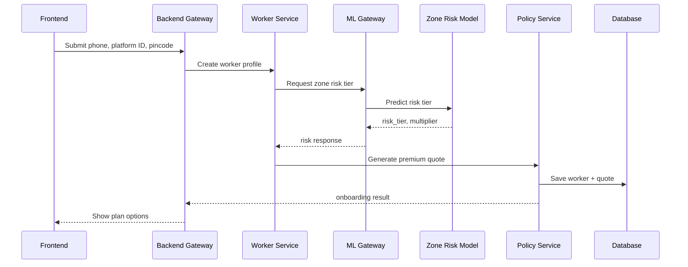
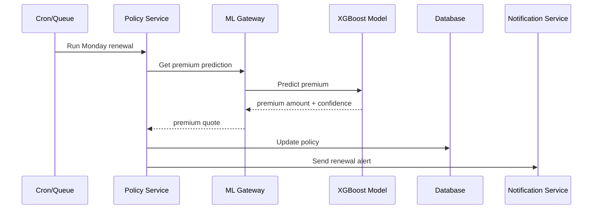
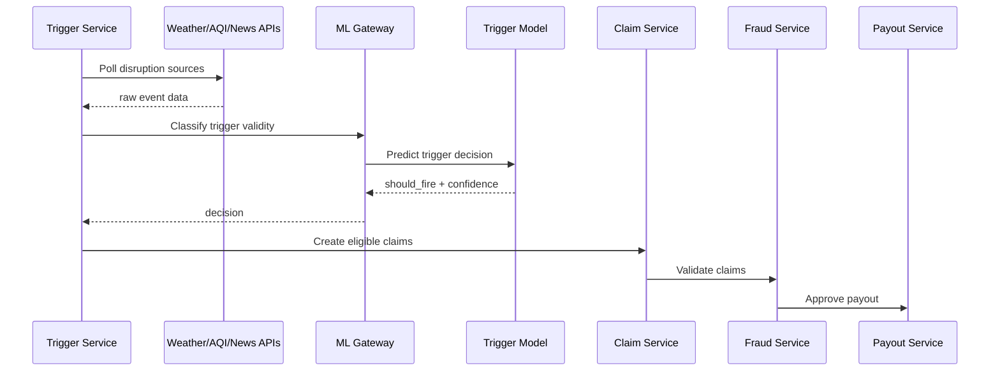
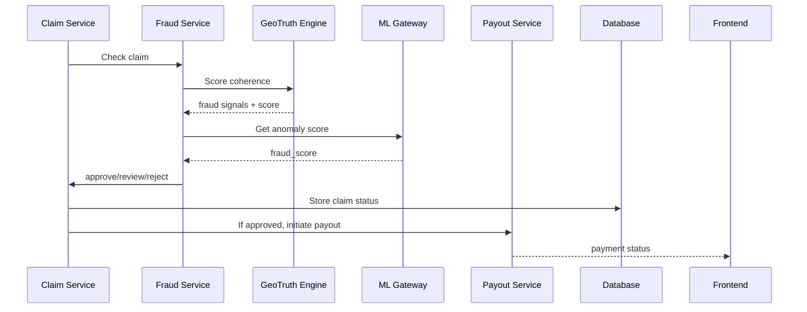
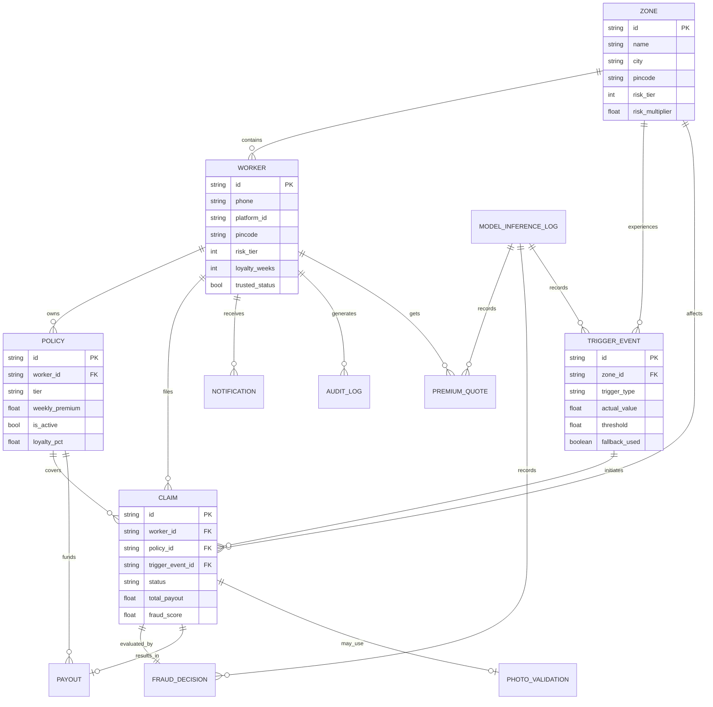

# Paymigo Backend Architecture & Implementation Guide

## 1. What the Backend Must Do

For this project, the backend should be the central orchestrator of the entire system, going beyond simple CRUD operations.

**Core Backend Responsibilities:**
- Authentication and worker onboarding
- Policy creation and weekly renewal
- Trigger ingestion and event detection
- Claim orchestration
- Fraud validation
- Payout initiation
- Notification delivery
- Audit logging and analytics
- ML service orchestration
- Admin dashboard data aggregation

## 2. Recommended Backend Architecture

To prepare for microservices and future cloud/Kubernetes/DevOps expansion, the architecture should be designed in layers:

### A. API Gateway / BFF
- Single entry point for the frontend.
- Routes requests to internal services.
- Handles authentication, rate limiting, and validation.
- Returns responses in a frontend-friendly format.

### B. Domain Microservices
Each service owns exactly one business capability:
- **Auth Service**
- **Worker Service**
- **Policy Service**
- **Trigger Service**
- **Claim Service**
- **Fraud Service**
- **Payout Service**
- **Notification Service**
- **Analytics Service**
- **ML Gateway Service** (Adapter between backend and ML services)

### C. Shared Infrastructure
- PostgreSQL + PostGIS
- Redis cache
- Message queue
- Object storage (for evidence/images/logs)
- Audit log store

---

## 3. Updated Folder Structure

This backend-oriented structure is recommended for the repository:

```text
paymigo/
│
├── apps/
│   ├── web/                          # Frontend (Next.js PWA + Admin)
│   ├── ml-service/                   # Python FastAPI ML inference service
│   └── api/                          # Backend microservices layer
│       ├── gateway/                  # API gateway / BFF
│       │   ├── src/
│       │   │   ├── routes/
│       │   │   ├── middleware/
│       │   │   ├── validators/
│       │   │   ├── clients/
│       │   │   └── server.ts
│       │   └── Dockerfile
│       │
│       ├── services/
│       │   ├── auth-service/
│       │   ├── worker-service/
│       │   ├── policy-service/
│       │   ├── trigger-service/
│       │   ├── claim-service/
│       │   ├── fraud-service/
│       │   ├── payout-service/
│       │   ├── notification-service/
│       │   ├── analytics-service/
│       │   └── ml-gateway-service/
│       │
│       └── shared/
│           ├── contracts/
│           ├── dto/
│           ├── enums/
│           ├── errors/
│           ├── utils/
│           ├── events/
│           └── types/
│
├── packages/
│   ├── database/
│   │   ├── prisma/
│   │   ├── migrations/
│   │   └── seed/
│   │
│   ├── geotruth/                    # Python package for spoof/fraud detection
│   │   ├── geotruth/
│   │   │   ├── __init__.py
│   │   │   ├── engine.py
│   │   │   ├── sensors/
│   │   │   ├── network/
│   │   │   ├── motion/
│   │   │   ├── scoring/
│   │   │   └── models/
│   │   ├── tests/
│   │   └── pyproject.toml
│   │
│   └── event-bus/
│       ├── schemas/
│       └── consumers/
│
├── infra/
│   ├── docker/
│   ├── kubernetes/
│   ├── terraform/
│   ├── helm/
│   └── ci-cd/
│
├── docs/
│   ├── api/
│   ├── lld/
│   ├── erd/
│   └── architecture/
│
└── docker-compose.yml
```

---

## 4. Service-by-Service Breakdown

### 4.1. Auth Service
**Owns:** OTP login, JWT/session issuance, role-based access control.  
**Endpoints:**
- `POST /auth/send-otp`
- `POST /auth/verify-otp`
- `POST /auth/logout`
- `GET /auth/me`

### 4.2. Worker Service
**Owns:** Worker profile, pincode/zone mapping, platform ID, onboarding status.  
**Endpoints:**
- `POST /workers`
- `GET /workers/:id`
- `PATCH /workers/:id`
- `GET /workers/:id/profile`

### 4.3. Policy Service
**Owns:** Plan selection, weekly premium calculation, activation/renewal/cancellation, loyalty tier tracking.  
**Endpoints:**
- `POST /policies`
- `GET /policies/:id`
- `PATCH /policies/:id/renew`
- `PATCH /policies/:id/cancel`

### 4.4. Trigger Service
**Owns:** Polling external disruption sources (weather, AQI, alerts), threshold detection, trigger event creation, ML classification.  
**Endpoints:**
- `POST /triggers/poll`
- `POST /triggers/evaluate`
- `GET /triggers/active`
- `GET /triggers/history`

### 4.5. Claim Service
**Owns:** Claim lifecycle, creation, status updates, approval/rejection/review workflows.  
**Endpoints:**
- `POST /claims`
- `GET /claims/:id`
- `GET /claims/worker/:workerId`
- `PATCH /claims/:id/status`

### 4.6. Fraud Service
**Owns:** GeoTruth orchestration, anomaly scoring, GPS spoof validation, peer validation, manual review routing.  
**Endpoints:**
- `POST /fraud/check`
- `POST /fraud/geotruth`
- `POST /fraud/gps-check`
- `POST /fraud/peer-check`
- `GET /fraud/review-queue`

### 4.7. Payout Service
**Owns:** Payout calculation, UPI/Razorpay initiation, webhook confirmation, status updates.  
**Endpoints:**
- `POST /payouts/initiate`
- `POST /payouts/webhook`
- `GET /payouts/:id`
- `GET /payouts/worker/:workerId`

### 4.8. Notification Service
**Owns:** SMS, WhatsApp, push notifications, claim alerts, renewal reminders, payout confirmations.  
**Endpoints:**
- `POST /notifications/send`
- `POST /notifications/broadcast-zone`
- `GET /notifications/history`

### 4.9. Analytics Service
**Owns:** Admin KPIs, zone risk trends, claim trends, loss ratios, forecast dashboards.

### 4.10. ML Gateway Service
Acts as the bridge to ML models. The backend should never call ML models directly from the frontend.  
**Flow:** `Frontend → Backend API → ML Gateway → ML Service → Backend API → Frontend`  
**Provides:** Validation, auth logging, retries, fallback handling, response shaping.

---

## 5. ML Model Response Contracts

### 5.1. Zone Risk Clustering Model (K-Means)
- **Purpose:** Assign zone risk tier.
- **Inputs:** pincode, rainfall history, AQI history, flood frequency, disruption history.
```json
{
  "pincode": "400093",
  "zone_risk_tier": 4,
  "zone_risk_label": "high",
  "zone_risk_multiplier": 1.25,
  "confidence": 0.91
}
```

### 5.2. Dynamic Premium Model (XGBoost)
- **Purpose:** Calculate weekly premium.
- **Inputs:** zone_risk_tier, month, forecast_score, aqi_avg, platform_tenure_weeks, loyalty_weeks, disruption_rate, policy_tier, peer_claim_rate.
```json
{
  "worker_id": "W001",
  "recommended_weekly_premium": 143,
  "tier_floor": 119,
  "tier_ceiling": 149,
  "risk_adjustment_reason": [
    "monsoon_season",
    "high_zone_risk",
    "high_aqi"
  ],
  "confidence": 0.87
}
```

### 5.3. Trigger Classifier (Random Forest)
- **Purpose:** Confirm if a threshold breach meets payout criteria.
- **Inputs:** trigger type, measured value, duration, source confidence, zone consensus.
```json
{
  "trigger_type": "rainfall",
  "should_fire": true,
  "confidence": 0.94,
  "decision": "auto_fire",
  "reason": "sustained_heavy_rainfall"
}
```

### 5.4. Curfew NLP Model
- **Purpose:** Classify news/government texts for curfew/strike relevance.
- **Inputs:** headline, article text, source metadata.
```json
{
  "label": "curfew_detected",
  "confidence": 0.89,
  "zone": "Andheri East",
  "duration_hint": "6 hours",
  "keywords": ["Section 144", "movement restricted"]
}
```

### 5.5. Fraud Detector (Isolation Forest)
- **Purpose:** Detect anomalous claim behavior.
- **Inputs:** claim timing, payout amount, worker behavior, historical zone patterns, claim frequency.
```json
{
  "fraud_score": 0.78,
  "risk_level": "medium",
  "action": "manual_review"
}
```

### 5.6. GPS Spoofing Classifier (Random Forest)
- **Purpose:** Detect fake GPS traces.
- **Inputs:** movement history, location jumps, motion continuity, delivery route plausibility.
```json
{
  "spoof_probability": 0.93,
  "decision": "spoof_suspected",
  "signals": [
    "stationary_home_pattern",
    "impossible_location_jump"
  ]
}
```

### 5.7. Risk Forecaster (LSTM)
- **Purpose:** Predict 7-day disruption risk.
- **Inputs:** last 14 days weather/AQI trend.
```json
{
  "zone": "mumbai_andheri_east",
  "forecast_score": 0.81,
  "risk_band": "high",
  "next_7_days": [
    {"day": "D1", "probability": 0.72},
    {"day": "D2", "probability": 0.85}
  ]
}
```

### 5.8. Community Photo Validation Model
- **Purpose:** Validate disruption via visual evidence when APIs fail.
- **Inputs:** geotagged photo.
```json
{
  "is_valid": true,
  "classifier_score": 0.92,
  "scene_type": "heavy_rain_flooding"
}
```

---

## 6. GeoTruth Package Integration

GeoTruth should act as a specialized fraud sub-engine to grade decisions safely, not to instantly block workers.

**Flow:**
1. Claim is created.
2. Fraud Service calls GeoTruth.
3. GeoTruth computes coherence score.
4. Backend decides: auto approve, soft proof, human review, or freeze.

**Backend Response Example:**
```json
{
  "claim_id": "CLM123",
  "coherence_score": 64,
  "tier": "soft_proof",
  "flagged_signals": [
    "cell_tower_mismatch",
    "low_motion_variance"
  ],
  "sensor_gaps": [
    "barometer_absent"
  ],
  "recommendation": "REQUEST_SOFT_PROOF"
}
```

---

## 7. Backend Process Flows

### Flow A: Worker Onboarding


### Flow B: Weekly Premium Renewal


### Flow C: Trigger Detection


### Flow D: Claim Approval


---

## 8. Database Design

### Recommended Entities
1. **Worker:** Identity and profile.
2. **Zone:** Delivery geography.
3. **Policy:** Subscription and weekly coverage.
4. **PremiumQuote:** ML-generated premium results.
5. **TriggerEvent:** Live event records.
6. **Claim:** Claim lifecycle tracking.
7. **FraudDecision:** GeoTruth + ML fraud outputs.
8. **Payout:** Money transfer records.
9. **Notification:** SMS/push/WhatsApp logs.
10. **AuditLog:** Backend operations history.
11. **PhotoValidation:** Fallback visual evidence.
12. **ModelInferenceLog:** Records of all ML calls and responses.

### 9. ER Diagram



---

## 10. LLD for Backend Modules

### 10.1. Auth Module
- **Components:** `AuthController`, `AuthService`, `OtpProvider`, `JwtService`, `RoleGuard`
- **Responsibilities:** Verify worker identity, issue tokens, protect routes.

### 10.2. Worker Module
- **Components:** `WorkerController`, `WorkerService`, `WorkerRepository`, `ZoneResolver`
- **Responsibilities:** Profile management, pincode to zone mapping, fetch risk profiles.

### 10.3. Policy Module
- **Components:** `PolicyController`, `PolicyService`, `RenewalScheduler`, `PremiumCalculatorClient`
- **Responsibilities:** Policy creation, Monday renewals, cancellation, loyalty/premium calculation.

### 10.4. Trigger Module
- **Components:** `TriggerController`, `TriggerPollingJob`, `TriggerEvaluator`, `SourceAggregator`, `TriggerClassifierClient`
- **Responsibilities:** Poll source data, normalize inputs, compute trigger validity.

### 10.5. Claim Module
- **Components:** `ClaimController`, `ClaimService`, `ClaimWorkflowEngine`, `ClaimStatusMachine`
- **Statuses:** `pending`, `eligible`, `fraud_check`, `manual_review`, `approved`, `rejected`, `paid`

### 10.6. Fraud Module
- **Components:** `FraudController`, `GeoTruthAdapter`, `AnomalyScoreService`, `GpsSpoofChecker`, `PeerValidationService`
- **Decision Levels:** `AUTO_APPROVE`, `SOFT_PROOF`, `REVIEW`, `REJECT`

### 10.7. Payout Module
- **Components:** `PayoutController`, `PayoutService`, `RazorpayClient`, `WebhookHandler`
- **Responsibilities:** Payout calculation, API transfers, Webhook reconciliation.

### 10.8. Notification Module
- **Components:** `NotificationController`, `NotificationService`, `SmsProvider`, `PushProvider`, `TemplateEngine`

---

## 11. Backend APIs to Build First (MVP Order)

1. `POST /auth/send-otp`
2. `POST /auth/verify-otp`
3. `POST /workers`
4. `GET /workers/:id`
5. `POST /policies`
6. `GET /policies/:id`
7. `POST /premium/calculate`
8. `POST /triggers/evaluate`
9. `POST /claims`
10. `POST /fraud/check`
11. `POST /payouts/initiate`
12. `POST /payouts/webhook`

---

## 12. Frontend-Backend Data Flows

The frontend should *never* talk directly to ML services. It should receive:
- Worker profile
- Zone risk badge
- Premium quote
- Active policy status
- Trigger live status
- Claim timeline
- Payout receipt
- Fraud review state
- Admin analytics summary

---

## 13. Backend Response Contracts

### Example: Onboarding Response
```json
{
  "worker_id": "W001",
  "zone": "Andheri East",
  "risk_tier": 4,
  "risk_label": "high",
  "weekly_premium": 143,
  "eligible_plans": ["basic", "standard", "premium"],
  "policy_status": "inactive"
}
```

### Example: Trigger Response
```json
{
  "trigger_id": "TRG1001",
  "trigger_type": "rainfall",
  "zone": "Andheri East",
  "is_active": true,
  "confidence": 0.94,
  "affected_workers": 182
}
```

### Example: Fraud Response
```json
{
  "claim_id": "CLM9001",
  "coherence_score": 72,
  "fraud_score": 0.31,
  "decision": "soft_proof",
  "recommended_action": "ask_for_location_video"
}
```

### Example: Payout Response
```json
{
  "payout_id": "PAY7781",
  "claim_id": "CLM9001",
  "amount": 420,
  "status": "processing",
  "provider": "razorpay"
}
```

---

## 14. Event-Driven Backend Design

Adopt an event-driven architecture to scale effectively into containers (Docker/K8s) and async jobs.

**Suggested Events:**
- `worker.created`
- `policy.activated`
- `premium.calculated`
- `trigger.fired`
- `claim.created`
- `fraud.flagged`
- `payout.initiated`
- `payout.completed`
- `notification.sent`

---

## 15. Recommended Backend Tech Stack

- **Domain services:** Node.js + NestJS (or Express)
- **ML Gateway integration:** Python FastAPI
- **Database ORM:** Prisma
- **Core Data Storage:** PostgreSQL + PostGIS
- **Cache & Queues:** Redis
- **Audit/Events Storage:** MongoDB
- **Event Bus:** RabbitMQ / BullMQ / Kafka
- **Orchestration:** Docker Compose (local env)

---

## 16. What to Build First (Order of Execution)

1. **Step 1:** Build the database schema and migrations.
2. **Step 2:** Build Auth + Worker + Policy services.
3. **Step 3:** Build the ML gateway service contract.
4. **Step 4:** Build Trigger service.
5. **Step 5:** Build Claim service.
6. **Step 6:** Build Fraud service with GeoTruth.
7. **Step 7:** Build Payout service.
8. **Step 8:** Build Notification and Analytics.
9. **Step 9:** Connect Frontend to Backend APIs.

---

## 17. Final Architecture Summary

- **Frontend:** Shows UI screens.
- **Backend:** Owns business logic and orchestrates systems.
- **ML Service:** Generates predictions and classifiers.
- **GeoTruth:** Evaluates fraud and spoofing.
- **Database:** Stores records.
- **Payout Service:** Initiates money transfers.
- **Notifications:** Inform the user immediately on events.

---

## 18. Best Practical Mindset for Your Team

Distribute work functionally and intentionally:

| Role | Main Responsibility |
|---|---|
| **Backend Engineer** | APIs, service orchestration, auth, claims, payouts |
| **DBA / Data Engineer** | Schema, migrations, indexing, DB performance |
| **ML Engineer** | Inference endpoints, model packaging, contracts |
| **MLOps Engineer** | Deployment, monitoring, versioning, rollback |
| **Frontend/UI Engineer** | UI design, state management, API integration |
| **System Designer** | Service boundaries, flows, data reliability concerns |

---

## 19. What I Recommend Next

Build the backend as three core layers first:
1. **Identity + policy**
2. **Trigger + claim**
3. **Fraud + payout**

This strategy delivers a functional, working vertical slice from day one. *(If needed, we can expand this into complete LLD documents, API specs, DB Prisma schemas, and direct implementation templates).*