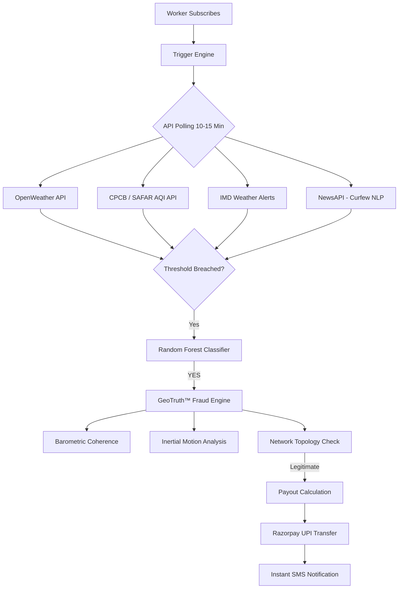

# PayMigo — AI-Powered Parametric Income Insurance
**Guidewire DEVTrails 2026 | Team HackDragonz | Persona: Food Delivery Partners**

<div align="center">
  
  <p>
    <strong>"When the sky shuts you down, PayMigo pays you. Automatically. In under 90 seconds."</strong>
  </p>
  <br />
  <a href="#1-why-food-delivery">Persona</a> •
  <a href="#4-parametric-triggers">Triggers</a> •
  <a href="#5-geotruth-fraud-defense">GeoTruth™</a> •
  <a href="#6-loyalty--continuity">Loyalty</a> •
  <a href="#7-tech-stack">Stack</a> •
  <a href="#11-business-viability">GTM Strategy</a>
</div>

---

## 1. Why Food Delivery — Persona Justification
We chose **Food Delivery Partners (Zomato / Swiggy)** for three concrete reasons:

1.  **Scale**: India has over **5.2 million** active food delivery partners, representing >75% of the total gig delivery segment.
2.  **Disruption Frequency**: Unlike E-commerce workers who can reschedule, a food delivery worker caught in a 3-hour rainstorm loses that income **permanently**.
3.  **Payment Cycle**: Zomato/Swiggy pay partners weekly every Monday, which aligns perfectly with PayMigo's **Weekly Premium Model**.

### 📉 The Problem: A Typical Disruption Week
| Day | Condition | Orders | Earnings | Status |
|---|---|---|---|---|
| Monday | Clear | 22 | ₹1,100 | ✅ |
| Wednesday | **Heavy Rain — IMD Red Alert** | 3 | ₹180 | ❌ **₹800 Loss** |
| Thursday | **AQI > 350 — Severe** | 0 | ₹0 | ❌ **₹1100 Loss** |
| Friday | **City Curfew — Section 144** | 0 | ₹0 | ❌ **₹1100 Loss** |
| **Total** | | | **₹4,730** | **~30% Loss** |

---

## 2. Our Strategy Pillars

### 💰 Three Weekly Plans — With Surge Pricing
Existing subscribers are **Locked at their rate**. Surge pricing only applies to new sign-ups during high-risk periods.

| Plan | Normal Week | Disruption Week | Base Payout/Event |
|---|---|---|---|
| 🟤 **Basic Shield** | ₹69/week | ₹89/week | ₹600 |
| 🔵 **Standard Shield** | ₹119/week | ₹149/week | ₹1,000 |
| 💎 **Premium Shield** | ₹179/week | ₹225/week | ₹1,600 |

### 🔥 Progressive Loyalty Multiplier (Streak Engine)
Stay enrolled longer to unlock massive payout multipliers.
| Streak | Weeks Paid | Multiplier | Payout Example (₹700 loss) |
|---|---|---|---|
| Starter | Week 1–3 | 1.0x | ₹700 |
| Silver | Week 8–11 | 1.6x | ₹1,120 |
| Platinum | Week 16–19 | 3.0x | ₹2,100 |
| **Diamond** | **Week 20+** | **4.0x** | **₹2,800** |

---

## 3. Data & Trigger Flow Architecture


---

## 4. Parametric Triggers — Threshold Justification
| Trigger | Threshold | Official Basis | Max Daily Payout |
|---|---|---|---|
| **Heavy Rain** | > 50mm/hr | IMD "Heavy Rain" Red Alert criteria. | ₹480 |
| **Severe AQI** | > 300 | CPCB "Severe" category (Outdoor activity restricted). | ₹480 |
| **Heat Wave** | > 45°C | IMD Heat Wave declaration. | ₹360 |
| **Curfew** | Section 144 | Commercial assembly legally prohibited. | ₹540 |
| **Outage** | 90+ min Down | Platform SLA benchmark. | ₹300 |

---

## 5. GeoTruth™ Fraud Defense (The Secret Sauce)
Parametric insurance is vulnerable to GPS spoofing. **GeoTruth™** uses 7-layer verification to secure the pool.

1.  **Barometric Coherence**: Correlates phone sensor data with hyper-local IMD pressure drops (Cannot be spoofed).
2.  **Acoustic Fingerprinting**: Extracts 3-second ambient vectors to verify rain/wind noise signatures.
3.  **Network Topology**: Cross-validates cell tower IDs and residential WiFi SSIDs against GPS.
4.  **Inertial Motion**: Distinguishes "delivery motion" from "desk-sitting" spoofers using Accelerometer data.
5.  **Social Graph**: Flags bursts of claims triggered by "Tele-Coordination" (Fraud rings).
6.  **Isolation Forest**: Unsupervised ML to catch "Zero-Day" fraud tactics.
7.  **Community Photo Validation**: Encrypted, geotagged photos as an manual fallback.

---

## 6. Progressive Loyalty & Continuity
We solve the "Why pay when nothing happens?" question with a **Loss Ratio Protection Model**:
*   **Month 1**: 40% income replacement.
*   **Month 5+**: 80% income replacement.
*   **The Continuity Break Rule**: If you miss a week, your tier resets. This prevents "adverse selection" (workers only paying in July/August).

---

## 7. Tech Stack & Project Structure

### Folder Structure
```text
PayMigo_Final/
├── Paymigo_Frontend/web/      # Next.js 14 + Tailwind + Framer Motion
├── backend/                  # Node.js + Express + Prisma (Orchestrator)
└── ml-services/ML-Service/   # Python + FastAPI (GeoTruth™ Intelligence)
```

### AI Integration
*   **Pricing**: XGBoost (Premium calculation every Monday morning).
*   **NLP**: BERT-encoded Classifiers (Detecting localized curfews).
*   **Forecasting**: LSTM Neural Network (7-day risk heatmaps for insurers).
*   **Anomaly**: Isolation Forest (Real-time fraud scoring).

---

## 8. API Resilience & Fallback
**Tier 1 — Cache Replay**: Serving 15-minute buffered data if APIs fail.
**Tier 2 — 2-of-3 Rule**: Requiring confirmation from at least 2 weather sources (e.g., IMD + OpenWeather).
**Tier 3 — Crowdsourced Verification**: If all APIs fail, we poll active workers in the zone. If 7/10 submit matching photos, the trigger fires.

---

## 9. Database Schema (Prisma)
```prisma
model Worker {
  id              String   @id @default(cuid())
  phone           String   @unique
  cityZone        String
  riskTier        Int      @default(1)
  loyaltyMonthTier Int     @default(1) // 1-5 maps to 40%-80%
  totalPremiumPaid Float   @default(0)
  trustedStatus   Boolean  @default(false)
  policies        Policy[]
  claims          Claim[]
}

model Claim {
  id             String   @id @default(cuid())
  triggerType    String   // "rainfall" | "aqi" | "curfew"
  totalPayout    Float
  fraudScore     Float
  status         String   // "auto_approved" | "manual_review"
}
```

---

## 10. GTM & Business Viability
*   **Revenue Model**: 17% technology fee per premium through our insurer partner (ACKO/Digit).
*   **CAC (Customer Acquisition Cost)**: Estimated at **₹140/worker** via:
    *   **Area Team Leaders (ATLs)**: Referral commissions for group enrollments.
    *   **Hub Service Centres**: QR code posters at local delivery battery-swap stations.
    *   **WhatsApp Communities**: Peer-to-peer viral growth loops.

---

## 11. Running Locally
1.  **Start Services**: `docker-compose up -d` (PostgreSQL + Redis).
2.  **ML Service**: `cd ml-services/ML-Service && uvicorn app.main:app`.
3.  **Backend**: `cd backend && node server.js`.
4.  **Frontend**: `cd Paymigo_Frontend/web && npm run dev`.

### Train Models:
```bash
python app/models/zone_clusterer/train.py
python app/models/premium_engine/train.py
python app/models/fraud_detector/train.py
```

---

<div align="center">
  <br />
  <strong>Built for impact. Engineered for survival. 🚀</strong>
  <br />
  <em>Guidewire DEVTrails 2026 | Team HackDragonz</em>
</div>