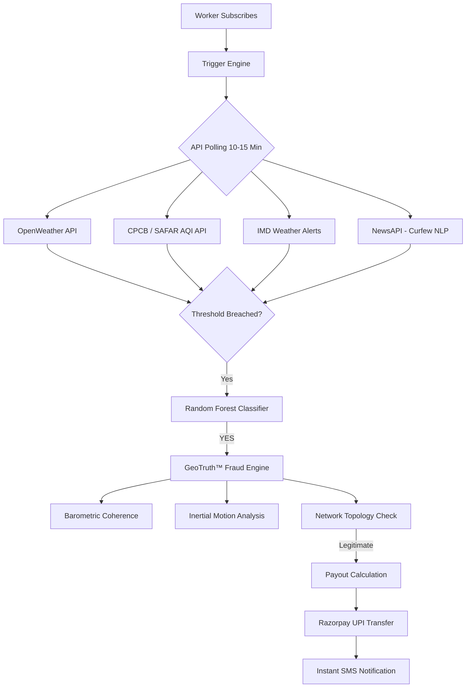

# PayMigo (GigKavach GeoTruth™)
**AI-Powered Parametric Income Insurance for India's 5.2M Food Delivery Workers**

---

<div align="center">
  
  <h1 align="center">PayMigo Master README</h1>
  <p align="center">
    <strong>Guidewire DEVTrails 2026 | Team HackDragonz | Food Delivery Persona — Zomato / Swiggy</strong>
  </p>
  <br />
  <a href="#1-why-food-delivery--persona-justification">Persona Justification</a> •
  <a href="#5-weekly-premium-model--pricing-strategy">Pricing & XGBoost</a> •
  <a href="#7-parametric-triggers--threshold-justification">Trigger Logic</a> •
  <a href="#11-ai--machine-learning-integration">ML Whitepaper</a> •
  <a href="#13-adversarial-defense--anti-spoofing-strategy">GeoTruth™ Defense</a>
</div>

---

> **Coverage Scope:** INCOME LOSS ONLY (No health/accident) | **Pricing Model:** WEEKLY (Aligned with gig payout cycles)

---

## 1. Why Food Delivery — Persona Justification

We chose **Food Delivery Partners (Zomato / Swiggy)** over E-commerce or Q-Commerce for three concrete reasons:

*   **Scale of the problem**: India has over **5.2 million active partners**, the largest segment of the gig economy. Food delivery represents >75% of the total addressable population.
*   **Disruption Frequency**: Disruption (rain, heat, AQI peaks) happens exactly when food delivery demand is highest. A worker who cannot work during a 3-hour rain event loses those earnings permanently—there is no rescheduling. 
*   **Payment Cycle Alignment**: Payouts happen every Monday, mapping directly to PayMigo's weekly premium model. This creates zero cash flow friction.

### 📉 The Problem: A Real Disruption Week
| Day | Condition | Orders | Earnings | status |
|---|---|---|---|---|
| Monday | Clear | 22 | ₹1,100 | ✅ |
| Wednesday | **Heavy Rain — IMD Red Alert** | 3 | ₹180 | ❌ **₹800 Loss** |
| Thursday | **AQI > 350 — Severe** | 0 | ₹0 | ❌ **₹1100 Loss** |
| Friday | **City Curfew — Section 144** | 0 | ₹0 | ❌ **₹1100 Loss** |
| **Total** | | | **₹4,730 vs ₹6,720** | **~30% Loss** |

---

## 2. Our Strategy Pillars

### 💡 Weekly Premium Model
| Plan | Low Risk Zone | High Risk Zone | Max Daily Payout | Max Weekly Payout |
|---|---|---|---|---|
| **Basic** | ₹69/week | ₹99/week | ₹350 | ₹1,050 |
| **Standard** | ₹109/week | ₹159/week | ₹550 | ₹1,650 |
| **Premium** | ₹179/week | ₹229/week | ₹850 | ₹2,550 |

---

## 3. Data & Trigger Flow Architecture


---

## 4. Parametric Triggers — Threshold Justification

| Trigger | Threshold | Official Basis | Max Daily Payout |
|---|---|---|---|
| **Heavy Rainfall** | > 50mm/hr | IMD "Heavy Rain" Red Alert criteria (>115mm/day intensity). | ₹480 |
| **Severe Pollution** | AQI > 300 | CPCB "Severe" category (Health risk recognized for labor). | ₹480 |
| **Extreme Heat** | Temp > 45°C | IMD Heat Wave declaration (outdoor assembly restricted). | ₹360 |
| **Curfew / Strike** | Section 144 | Commercial Assembly becomes legally impossible. | ₹540 |
| **Platform Outage** | 90+ min Down | Zomato/Swiggy SLA "Service Degradation" benchmark. | ₹300 |

**Payout Formula:**
`Daily Payout = ₹60 × Blocked Hours × Zone Multiplier × Tier Multiplier × Loyalty Payout %`

---

## 5. GeoTruth™: Adversarial Defense & Anti-Spoofing
Coordination between bad actors (e.g., via Telegram) makes GPS verification obsolete. **GeoTruth™** uses a **7-Layer Coherence Stack** to ensure the environmental reality matches the coordinates.

<details>
<summary><b>Click to expand GeoTruth™ Layer Details</b></summary>

1.  **Barometric Pressure Coherence**: Modern phones have barometric sensors. During storms/cyclones, pressure drops. If the phone reads high pressure while the zone is under a storm, the claim is flagged as spoofed.
2.  **Passive Acoustic Fingerprinting**: (Edge ML) Extracts 3-second ambient vectors to verify rain/wind noise profiles without transmitting or storing audio.
3.  **Network Topology Truth**: Validates which Cell Tower IDs and residential WiFi SSIDs are visible. Changes in tower IDs confirm physical movement.
4.  **Inertial Motion Signature**: Uses accelerometer/gyroscope data to identify "delivery-worker motion" patterns vs "stationary desk" spoofing.
5.  **Platform Activity Cliff**: If a disruption is real, ALL workers in the zone stop getting orders simultaneously. Lone claims with active neighbors are flagged.
6.  **Historical Behavioral Baseline**: Every worker builds a "Personal Trust Profile." Sudden activity in a new zone at 2AM is suspicious.
7.  **Social Coordination Graph**: Detects "Temporal Bursts" where claims arrive exactly at the same minute, indicating a Telegram-led ring attack.

</details>

---

## 6. Progressive Loyalty & Continuity
PayMigo rewards unbroken coverage through a **Progressive Payout Ladder**:
| Continuous Coverage | Payout % of verified income loss |
|---|---|
| Month 1 | 40% replacement |
| Month 3 | 60% replacement |
| **Month 5+** | **80% replacement** |

**Loyalty Pool Bonus**: Accumulate up to **25% of premiums paid** as a bonus pool, unlocked for withdrawal during major disruption events (Capped at ₹500/event).

---

## 7. AI & Machine Learning Integration (The Whitepaper)
PayMigo utilizes **7 distinct ML models** to drive our decision intelligence.

<details>
<summary><b>View ML Model Specifications</b></summary>

### Model 1: Zone Risk Clustering (K-Means)
**Input**: Historical rainfall frequency, Annual flood days, Average AQI.  
**Output**: Risk Tier (1–5) assigned to every Indian pincode.

### Model 2: Dynamic Premium Calculator (XGBoost)
Premiums are recalculated every Monday using 9 features:
*   `zone_risk_tier`
*   `7day_forecast_score` (LSTM prediction)
*   `loyalty_weeks_paid` (Rewarding persistence)
*   `peer_claim_rate_zone` (Real-time risk feedback)

### Model 3: Trigger Classifier (Random Forest)
Determines if a threshold breach is a sustained "Disruption Event" or a false positive burst.

### Model 4: Curfew Detection (TF-IDF + NLP)
Classifies NewsAPI and PIB RSS headlines to detect localized Section 144 orders or strike conditions.

### Model 5: GPS Spoofing Classifier (Random Forest)
Classifies GPS traces as "Legitimate Delivery Motion" vs "Teleportation" or "Stationary Farm."

</details>

---

## 8. API Resilience & Fallback Strategy (SLA)
**How we handle API downtime:**
*   **Tier 1 — Cache Replay**: Serving 15-minute buffered data if APIs fail.
*   **Tier 2 — 2-of-3 Rule**: Requiring confirmation from at least 2 weather sources (e.g., IMD + OpenWeather).
*   **Tier 3 — Crowdsourced Verification**: If all APIs fail, we poll active workers in the zone for geotagged photos. If 7/10 match, the trigger fires at 70% payout.

---

## 9. Business Viability & GTM Strategy
PayMigo is an **IRDAI Innovation Sandbox** ready product.

*   **Financials**: 17% technology fee from all premiums. Total TAM at full penetration: **₹2,298 Crore GWP**.
*   **CAC (Customer Acquisition)**: Estimated at **₹140/worker**.
*   **GTM Strategy**:
    *   **Area Team Leaders (ATLs)**: Engaging team leads of 200-500 workers with referral commissions.
    *   **Hub posters**: QR codes at bike repair shops and battery-swap stations.
    *   **WhatsApp Groups**: Viral peer-to-peer growth loops.

---

## 10. Tech Stack & Project Structure
*   **Frontend**: Next.js 14 (Worker PWA + Admin Canvas), Framer Motion, Tailwind CSS.
*   **Backend**: Node.js, Express, Prisma ORM, PostgreSQL (PostGIS enabled).
*   **ML**: Python 3.11, FastAPI, scikit-learn, XGBoost, TensorFlow (LSTM).
*   **Infrastructure**: Redis (Upstash), Docker Compose, Razorpay (UPI Payouts).

---

## 11. Running Locally
1.  **Clone & Install**: `npm install && pip install -r requirements.txt`
2.  **Launch DB**: `docker-compose up -d`
3.  **Train Models**:
    ```bash
    python app/models/zone_clusterer/train.py
    python app/models/premium_engine/train.py
    ```
4.  **Start Platform**: `npm run dev` (Runs Next.js, FastAPI, and Backend concurrently).

---

<div align="center">
  <br />
  <strong>Guidewire DEVTrails 2026 | Built for impact. Engineered for survival. 🚀</strong>
</div>