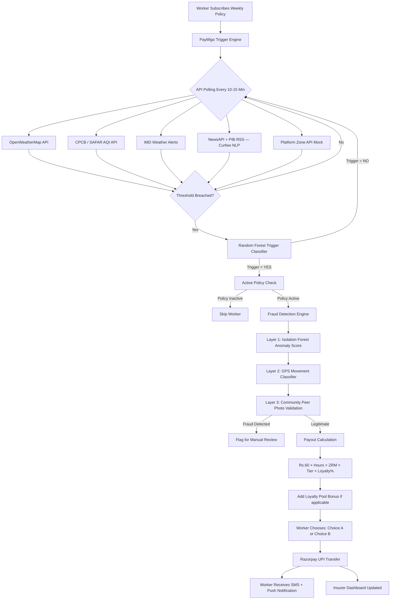

# PayMigo  AI-Powered Parametric Income Insurance for Food Delivery Workers

**Guidewire DEVTrails 2026 | Team HackDragonz | Food Delivery Persona — Zomato / Swiggy**

> **Coverage Scope: INCOME LOSS ONLY**  No health, accident, vehicle, or life coverage.  
> **Pricing Model: WEEKLY only** — Always aligned with gig worker payout cycles.

| Resource | URL |
|---|---|
| GitHub Repository |https://github.com/darshanar190607/Guidewire_Devtrails.git|
| Phase 1 Strategy Video |https://youtu.be/CJcxim5aT-E |
| Phase 2 Demo Video |https://youtu.be/VeZXEUuPCfs|
| Phase 3 Final Video | [Added April 17] |
| Live Deployment | pay-migo-frontend-8pow-34gj3nqev.vercel.app |
| ML Service API Docs | [Add your Render link here]/docs |
| Figma Wireframes | [Add your Figma link here] |

---

## Table of Contents

1. [Why Food Delivery — Persona Justification](#1-why-food-delivery--persona-justification)
2. [The Problem](#2-the-problem)
3. [Our Solution](#3-our-solution)
4. [Target Persona](#4-target-persona)
5. [Weekly Premium Model & Pricing Strategy](#5-weekly-premium-model--pricing-strategy)
6. [Progressive Loyalty & Continuity System](#6-progressive-loyalty--continuity-system)
7. [Parametric Triggers — Threshold Justification](#7-parametric-triggers--threshold-justification)
8. [Data & Trigger Flow Architecture](#8-data--trigger-flow-architecture)
9. [API Resilience & Fallback Strategy](#9-api-resilience--fallback-strategy)
10. [Application Walkthrough](#10-application-walkthrough)
11. [AI & Machine Learning Integration](#11-ai--machine-learning-integration)
12. [Fraud Detection Architecture](#12-fraud-detection-architecture)
13.  [Adversarial Defense & Anti-Spoofing Strategy](#13-adversarial-defense--anti-spoofing-strategy)
14. [Tech Stack & Architecture Decisions](#13-tech-stack--architecture-decisions)
15. [Project Structure](#14-project-structure)
16. [Database Schema](#15-database-schema)
17. [Business Viability & Go-To-Market Strategy](#16-business-viability--go-to-market-strategy)
18. [Six-Week Delivery Plan](#17-six-week-delivery-plan)
19. [Running Locally](#18-running-locally)


---

## 1. Why Food Delivery  Persona Justification

We chose **Food Delivery Partners (Zomato / Swiggy)** over E-commerce (Amazon/Flipkart) or Q-Commerce (Zepto/Blinkit) for three concrete reasons.

**Scale of the problem.** India has over **5.2 million active food delivery partners**, the largest single segment of the gig delivery economy. E-commerce delivery workers number approximately 1.2 million; Q-Commerce workers approximately 0.4 million. Food delivery represents more than 75% of the total addressable gig delivery population giving PayMigo the best differentiator to choose this persona

**Disruption frequency is highest in food delivery.** Food delivery workers operate across all weather conditions during peak dinner and lunch hours  exactly when disruptions like rain, heat, and AQI(Air Quality Index) spikes are most severe. Unlike E-commerce workers who can reschedule next-day deliveries, a food delivery worker who cannot work during a 3-hour rain event loses those earnings permanently. There is no rescheduling. The income loss is immediate, irreversible, and happens multiple times per monsoon season.

**Payment cycle alignment.** Zomato and Swiggy pay their delivery partners weekly every Monday, which maps directly to PayMigo's weekly premium deduction model. This means the worker's premium is deducted on the same day they receive their platform settlement — creating zero cash flow friction. E-commerce platforms pay fortnightly or monthly, which would require us to redesign our auto-renewal architecture entirely.

**Premium pool solvency under mass disruption events.** This is a genuine challenge we have designed for. When a disruption (like heavy rain) affects an entire zone simultaneously, many workers will trigger claims at once. Our mitigation strategy has three layers:

- **Zone isolation:** Premiums are pooled and claims are paid zone-by-zone. Mumbai Andheri East has its own actuarial pool separate from Pune Kothrud. A flood in Mumbai does not deplete premiums collected from low-risk zones in Coimbatore.

- **Tiered payout caps:** Each plan tier has a maximum weekly payout (Rs.900 / Rs.1,500 / Rs.2,400). Even in a worst-case week where all workers in a zone trigger claims, the total payout is bounded by the tier caps — never the full salary loss.

- **Progressive payout model:** Workers only receive partial salary replacement (40% to 80% depending on their loyalty tier), not full salary replacement. This is explicitly not full indemnity insurance — it is parametric income protection. This is the key design choice that keeps the product solvent.

---
## 💡 Our Strategy Pillars

---

### 1. Three Weekly Plans — With Smart Surge Pricing

We offer three simple plans. On normal days, you pay the base price.
On risky disruption periods, the price adjusts slightly to cover higher payout risk.

| Plan | Normal Week | Disruption Week | Base Payout/Event |
|---|---|---|---|
| 🟤 Basic Shield | ₹69/week | ₹89/week | ₹600 |
| 🔵 Standard Shield | ₹119/week | ₹149/week | ₹1,000 |
| 💎 Premium Shield | ₹179/week | ₹225/week | ₹1,600 |

> **Key Rule:** Existing subscribers are **ALWAYS locked at their current rate**.
> Surge pricing only applies to new sign-ups during a disruption period.
> This builds trust — we never charge you more mid-week.

---

### 2. 🔥 Progressive Loyalty Multiplier (Streak Engine)

The longer you pay without interruption, the **MORE** you get paid when disruption hits.

| Streak | Weeks Paid | Multiplier | Payout Example (₹700 loss) |
|---|---|---|---|
| Starter | Week 1–3 | 1.0x | ₹700 |
| Bronze | Week 4–7 | 1.25x | ₹875 |
| Silver | Week 8–11 | 1.6x | ₹1,120 |
| Gold | Week 12–15 | 2.2x | ₹1,540 |
| Platinum | Week 16–19 | 3.0x | ₹2,100 |
|Diamond | Week 20+ | 4.0x | ₹2,800 |

**Why this works:**
- Riders are rewarded for loyalty — the longer you stay, the more protected you are
- Insurers stay safe — high multipliers happen only when disruption frequency is historically low
- Streak resets on missed payment or fraud detection

**Streak Protection Features:**
-  **Streak Freeze** — Pay ₹15 to pause streak for up to 2 weeks (vacation/break)
-  **Streak Rescue** — Pay double premium within 48 hrs to restore a broken streak
-  **Milestone Cashbacks** — ₹20 at Week 4 → ₹500 at Week 52, credited directly to UPI
  
## 2. The Problem

India has over 5 million active food delivery partners working on platforms like Zomato and Swiggy. These workers earn between Rs.3,500 and Rs.7,000 per week entirely through completed deliveries. There is no fixed salary. When an external disruption occurs heavy rain, severe air pollution, a city-wide curfew, or a platform outage their income drops to zero immediately, yet their fixed costs continue without pause.

**A real disruption week:**

| Day | Condition | Orders | Earnings |
|---|---|---|---|
| Monday | Clear, moderate traffic | 22 | Rs.1,100 |
| Tuesday | Overcast | 18 | Rs.870 |
| Wednesday | Heavy rain — IMD Red Alert | 3 | Rs.180 |
| Thursday | AQI above 350 — Severe | 0 | Rs.0 |
| Friday | City curfew — Section 144 | 0 | Rs.0 |
| Saturday | Normal conditions | 20 | Rs.980 |
| Sunday | Festival surge | 28 | Rs.1,600 |
| **Total** | | | **Rs.4,730 vs Rs.6,720 projected** |

The worker lost **Rs.1,990 — nearly 30% of expected weekly earnings** across just three disruption days. Their fixed daily costs (fuel, vehicle EMI, mobile data, food) total Rs.326 to Rs.575 regardless of whether any earning happened.

**No existing product addresses this gap.** Government programs like PM-SBY and ESIC cover life and health risks — not income loss from external disruptions. Platform policies offer no wage replacement. Private gig insurance products focus exclusively on vehicle or accident coverage. The income protection gap is completely unaddressed by any existing product in India.

---

## 3. Our Solution

PayMigo is a parametric income insurance platform built **exclusively for food delivery workers**. It monitors external disruption data in real time, automatically detects when a worker cannot earn due to a verified disruption event, and transfers partial income protection directly to their UPI account — **without requiring the worker to file any claim.**

> **Core promise:** When the sky shuts you down, PayMigo pays you. Automatically. In under 90 seconds.

The platform operates on three technical pillars:

1. **Parametric Trigger Engine**  Polls weather, AQI, government alert, and platform APIs every 5 to 15 minutes. When a pre-defined, objectively measurable threshold is breached in a worker's active zone, the system initiates a claim without any human action.

2. **AI-Powered Dynamic Pricing Engine (XGBoost)** Calculates each worker's weekly premium every Monday using 9 hyper-local risk features. Premiums range from Rs.69 to Rs.229/week, always structured weekly to match the gig worker's settlement cycle.

3. **Multi-Layer Fraud Detection**  Isolation Forest anomaly detection + Random Forest GPS movement classifier + community peer validation. Ensures only genuine income loss events trigger payouts.

---

## 4. Target Persona

**Gokulnaath— Food Delivery Partner, Mumbai**

Gokulnaath is 24 years old and works primarily for Zomato, with occasional orders on Swiggy. He operates out of Andheri East, a flood-prone zone in Mumbai. He works 8 to 12 hours a day, six days a week, and earns between Rs.5,500 and Rs.7,000 per week under normal conditions. He uses a Redmi 9A (3GB RAM, Android 10), pays through PhonePe, and holds a Jan Dhan bank account. He has no insurance of any kind. Last month he lost Rs.2,100 across six disruption days.

**His primary fear:** *"Work doesn’t happen in the rain, but the EMI never stops"*  
*(Work stops in the rain, but the EMI doesn't.)*

**Device constraints we design for:** 3GB RAM Android, 2G/3G connectivity, Hindi primary language. This is why PayMigo is a PWA (no Play Store required), loads under 200KB on first render, and supports offline policy viewing.

---

## 5. Weekly Premium Model & Pricing Strategy

PayMigo uses a **weekly premium structure** because Zomato and Swiggy pay their delivery partners weekly every Monday. Deducting the PayMigo premium on the same day the worker receives their platform settlement removes the cash flow barrier entirely — the worker never feels the deduction.

### 5.1 Plan Tiers

| Plan | Low Risk Zone | High Risk Zone | Max Daily Payout | Max Weekly Payout | Triggers Covered |
|---|---|---|---|---|---|
| Basic | Rs.69/week | Rs.99/week | Rs.350 | Rs.1,050 | Rain + AQI |
| Standard | Rs.109/week | Rs.159/week | Rs.550 | Rs.1,650 | All 5 triggers |
| Premium | Rs.179/week | Rs.229/week | Rs.850 | Rs.2,550 | All 5 + Platform Outage |

> **Pricing rationale for high returns:** The floor has been set at Rs.69 (not Rs.49) and ceiling at Rs.229 based on a target loss ratio of 55–65%. At Rs.69/week Basic in a low-risk zone, with a weekly payout cap of Rs.1,050 and average disruption frequency of 1.8 events per month, the expected loss ratio sits at approximately 58% , leaving 42% to cover operations and profit. For high-risk zones at Rs.229/week, the higher frequency of events is offset by the higher premium, maintaining the same 55–65% loss ratio band.

### 5.2 XGBoost Dynamic Premium Calculator

Premiums are **not flat**. The XGBoost model recalculates every worker's exact premium every Monday morning using 9 input features:

| Feature | Description | Source |
|---|---|---|
| `zone_risk_tier` | K-Means cluster score (1–5) | Historical disruption data |
| `current_month` | Seasonal factor (monsoon = high) | Calendar |
| `7day_forecast_score` | LSTM disruption probability | Weather API + LSTM model |
| `aqi_7day_avg` | Rolling AQI average for zone | CPCB API |
| `platform_tenure_weeks` | Weeks active on platform | Platform mock API |
| `loyalty_weeks_paid` | Weeks paid without claiming | PayMigo DB |
| `historical_disruption_rate` | Zone-level disruption frequency | IMD historical data |
| `policy_tier` | Basic / Standard / Premium | Worker selection |
| `peer_claim_rate_zone` | Recent claim density in zone | PayMigo DB |

**Pseudocode logic:**

```python
features = [
    zone_risk_tier,       # 1.0 to 5.0
    current_month,        # 1 to 12 (monsoon months 6-9 get weight boost)
    lstm_forecast_score,  # 0.0 to 1.0 probability
    aqi_7day_avg,         # 0 to 500
    platform_tenure_weeks,# 1 to 200
    loyalty_weeks_paid,   # 0 to 52+ (reduces premium slightly)
    historical_disruption_rate,  # disruption days per year in zone
    policy_tier_encoded,  # 0=Basic, 1=Standard, 2=Premium
    peer_claim_rate_zone  # 0.0 to 1.0 (recent zone activity)
]

weekly_premium = xgboost_model.predict(features)
weekly_premium = clip(weekly_premium, tier_floor, tier_ceiling)
```

**Key model behaviors:**
- Workers in monsoon-affected zones (June–September) see premiums 15–30% higher than the same zone in winter.
- Workers with 20+ consecutive paid weeks (no claims) receive a loyalty discount of up to 8% off their calculated premium — rewarding commitment.
- A high peer claim rate in a zone increases the premium for new subscribers in that zone, reflecting real-time risk.

### 5.3 Training Data Schema

```csv
worker_id, zone_risk_tier, month, lstm_score, aqi_avg, tenure_weeks,
loyalty_weeks, disruption_rate, policy_tier, peer_claim_rate, actual_premium
W001, 4, 7, 0.82, 180, 24, 12, 8.2, 1, 0.34, 143
W002, 2, 2, 0.21, 65, 8, 0, 2.1, 0, 0.05, 78
W003, 5, 8, 0.91, 320, 36, 0, 11.4, 2, 0.61, 221
```

Synthetic training data (5,000 rows) generated using historical IMD rainfall data (2020–2024), CPCB AQI (Central Pollution Control Board)zone data, and simulated worker profiles. See `apps/ml-service/data/` for full datasets. 

---

## 6. Progressive Loyalty & Continuity System

The most common objection to micro-insurance among gig workers is: *"Why should I keep paying when nothing happens?"*

PayMigo answers this with a **Progressive Loyalty System** that rewards unbroken coverage through two dimensions: increasing payout percentages and accumulating loyalty bonuses.

### 6.1 Progressive Payout Percentage (The Core Mechanism)

The percentage of salary loss PayMigo replaces **grows the longer a worker stays enrolled.** This solves the solvency risk of paying 100% replacement from day one:

| Month of Continuous Coverage | Payout % of Verified Income Loss |
|---|---|
| Month 1 (Weeks 1–4) | 40% of verified loss |
| Month 2 (Weeks 5–8) | 50% of verified loss |
| Month 3 (Weeks 9–12) | 60% of verified loss |
| Month 4 (Weeks 13–16) | 70% of verified loss |
| Month 5+ (Week 17+) | 80% of verified loss (maximum) |

**Why this works for the business:** New subscribers who experience disruptions in week 1 receive only 40% replacement — protecting the pool during the high-risk early period when we have no behavioral data on them. Long-term members who have demonstrated genuine delivery activity receive up to 80%. This creates a financially stable product.

**Why this works for the worker:** The system incentivizes staying enrolled. A worker who quits and re-subscribes resets to 40%. This gives workers a compelling reason to maintain their policy through low-disruption periods.

### 6.2 Two Payout Choices on Disruption

When a disruption triggers, the worker receives a notification with **two choices:**

**Choice A — Full Immediate Reset:**  
Receive the maximum possible payout for this event based on their accumulated loyalty pool + standard parametric payout. After this, payout percentage **resets to 40%** for the next enrollment cycle. Best for workers who need maximum cash now.

**Choice B — Proportional Payout + Continue:**  
Receive the standard parametric payout at their current tier percentage. Loyalty bonus is partially applied (not fully consumed). Payout percentage **continues at current level** for next cycle. Best for workers who want to protect their long-term benefits.

### 6.3 Continuity Break Rule

If a worker **misses a weekly payment** (policy lapses for 1 week):
- Their loyalty tier drops by one level (e.g., Month 5 → Month 4 tier)
- If they miss 2 consecutive weeks, they restart at Month 1 (10%)
- This prevents workers from gaming the system by pausing during low-risk months

### 6.4 Loyalty Pool Bonus

In addition to the progressive payout, every week a worker pays premium without claiming accumulates a loyalty bonus pool:

| Continuous Paid Weeks (No Claims) | Pool Unlock % |
|---|---|
| 4–8 weeks | 10% of premiums paid |
| 9–16 weeks | 15% of premiums paid |
| 17–26 weeks | 20% of premiums paid |
| 26+ weeks | 25% of premiums paid |

Loyalty bonus is **capped at Rs.500 per event** to protect insurer solvency.

---

## 7. Parametric Triggers  Threshold Justification

PayMigo monitors **five external events** that directly cause income loss. Each threshold is anchored to an official Indian government classification — not an arbitrary number.

| Trigger | Threshold | Official Basis | Data Source | Max Daily Payout |
|---|---|---|---|---|
| Heavy Rainfall | > 50mm/hr OR IMD Red Alert active | IMD classifies > 64.4mm/day as "Heavy Rain" and > 115mm/day as "Very Heavy Rain." Our 50mm/hr threshold reflects the intra-day intensity that halts urban delivery operations, aligned with IMD's Red Alert advisory criteria. | IMD API + OpenWeatherMap | Rs.480 |
| Severe Pollution | AQI > 300 for 2+ hours | CPCB's AQI framework classifies 201–300 as "Very Poor" and 300+ as "Severe" — the level at which CPCB issues outdoor activity restrictions for vulnerable populations. Delivery work in AQI 300+ conditions constitutes an occupational health risk recognized by CPCB advisories. | CPCB + SAFAR API | Rs.480 |
| Extreme Heat | Temp > 45°C + Heat Index > 50°C | IMD declares a "Heat Wave" when maximum temperature exceeds 45°C in plains regions. India Meteorological Department advisories explicitly restrict outdoor physical labor during declared Heat Wave conditions. | IMD + MAUSAM Portal | Rs.360 |
| Curfew / Strike | Section 144 order OR official zone suspension verified | Section 144 CrPC prohibits assembly of more than 4 persons, making commercial delivery operations legally impossible in affected zones. Source: State Government notification feeds. | PIB RSS + NewsAPI + NLP classifier | Rs.540 |
| Platform Outage | Zero order allocation in zone for 90+ minutes | Zomato/Swiggy SLA documents reference 90 minutes as the threshold for a "service degradation" event. Our platform outage trigger mirrors this benchmark using mock platform API data + peer corroboration (min. 3 workers confirming zero orders). | Platform API Mock + Peer Network | Rs.300 |

**Payout Formula:**
```
Daily Payout = Rs.60 × Blocked Hours × Zone Risk Multiplier × Tier Multiplier × Loyalty Payout %
```

- **Zone Risk Multiplier:** 1.00 (Low) / 1.10 (Medium) / 1.25 (High)
- **Tier Multiplier:** 1.0 (Basic) / 1.2 (Standard) / 1.5 (Premium)
- **Loyalty Payout %:** 40% to 80% based on tenure (see Section 6)

---

## 8. Data & Trigger Flow Architecture



---

## 9. API Resilience & Fallback Strategy

**What happens when OpenWeatherMap, CPCB, or IMD APIs fail during the demo or in production?**

This is a real operational risk we have designed for explicitly. Our fallback is a **3-tier resilience chain:**

**Tier 1 — Cache replay (first 15 minutes):** All API responses are cached in Upstash Redis with a 15-minute TTL. If an API call fails, we serve the last valid response. For weather events, 15-minute-old data is still operationally valid — a rainstorm doesn't stop in 15 minutes.

**Tier 2 — Cross-source corroboration (15 to 60 minutes):** PayMigo polls 3 independent sources per trigger type (e.g., OpenWeatherMap + IMD + MAUSAM for rainfall). If one source goes down, the trigger can still fire from the other two, using a 2-of-3 majority rule.

**Tier 3 — Community Photo Validation (60+ minutes or total API failure):** This is our most innovative fallback. When all external APIs for a given trigger are unavailable:

1. The system detects API failure and sends a push notification to all active workers in the affected zone: *"APIs unavailable. Help us verify the disruption  submit a photo of current conditions."*
2. Workers submit a photo through their dashboard (geotagged + timestamped automatically).
3. Our image classifier (MobileNetV3, lightweight enough for FastAPI on Render free tier) validates that the photo shows rainfall / flooding / haze / empty streets  not a normal day.
4. If **7 out of 10** workers in a zone submit matching disruption photos within 30 minutes, the trigger fires at **70% payout** (reduced from normal because confidence is lower without API data).
5. The case is flagged for post-event manual review with all photos stored in MongoDB Atlas.

This fallback ensures workers are never left without coverage simply because a third-party API went down on a genuinely bad weather day.

---

## 10. Application Walkthrough

### 10.1 Worker Onboarding (Under 5 Minutes, Zero Paperwork)

Workers discover PayMigo through three channels (detailed in Section 16). The PWA opens directly in Chrome — no Play Store download required.

- **Step 1:** Phone OTP via Twilio SMS. Language selection: English, Hindi, or Tamil.
- **Step 2:** Zomato Partner ID entry. Platform mock API verifies active delivery status.
- **Step 3:** Pincode entry. K-Means model assigns zone risk tier (1–5) in background. Returns Zone Risk Multiplier.
- **Step 4:** Premium quote shown: *"Your zone: Andheri East. Risk level: High. Your weekly plan: Standard at Rs.143/week."* Worker selects Basic / Standard / Premium.
- **Step 5:** UPI payment via Razorpay. Policy activates within 60 seconds. Auto-renews every Monday — no action required from the worker ever again.

### 10.2 Automated Claim Flow (90-Second End-to-End)

```
T+0:00  Trigger engine detects rainfall = 85mm/hr in Zone X (OpenWeatherMap)
T+0:03  IMD API confirms Red Alert for same zone — 2-of-3 source corroboration
T+0:05  Random Forest Classifier confirms trigger: YES (confidence 0.94)
T+0:08  PostGIS query identifies all active policy holders in Zone X
T+0:12  3-layer fraud check runs per worker (Isolation Forest + GPS + Peer)
T+0:17  Payout calculated: Rs.60 × blocked_hours × 1.25 × 1.2 × loyalty_pct
T+0:19  Loyalty pool bonus added if applicable
T+0:21  Worker notification sent: "Disruption detected. Choose your payout option."
T+1:15  Worker selects Choice A or B (or auto-selects Choice B after 60s timeout)
T+1:27  Razorpay initiates UPI transfer
T+1:32  Payment confirmed via Razorpay webhook
T+1:33  SMS sent in worker's language: "PayMigo ne Rs.420 bheja — UPI se check karein"
T+1:33  Insurer dashboard claim record updated

Total elapsed time: under 90 seconds. Manual actions by worker: one optional tap.
```

---

## 11. AI & Machine Learning Integration

PayMigo uses **six ML models**, each solving a distinct problem. All are built with open-source libraries, serialised to `.pkl` or `.h5`, and served via FastAPI on Render's free tier.

### Model 1 — Zone Risk Clustering (K-Means) — Phase 1
**What it does:** Groups all Indian delivery pincodes into 5 risk tiers based on historical disruption data.  
**Input features:** Historical rainfall frequency, average annual flood days, average AQI, seasonal storm frequency, historical disruption claims per 1,000 workers.  
**Output:** Risk Tier (1–5) → Zone Risk Multiplier (1.00 to 1.25).  
**Library:** scikit-learn K-Means, `n_clusters=5`.

### Model 2 — Dynamic Premium Calculator (XGBoost) — Phase 2
**What it does:** Predicts optimal weekly premium per worker, recalculated every Monday.  
**Input features:** 9 features (see Section 5.2).  
**Output:** Weekly premium in Rs., clipped to tier floor/ceiling.  
**Library:** XGBoost 2.0, trained on 5,000 synthetic worker records.

### Model 3 — Trigger Classifier (Random Forest) — Phase 2
**What it does:** Binary classification — does this threshold breach warrant a payout trigger?  
**Why needed:** Raw API thresholds can produce false positives (e.g., 51mm/hr for 3 minutes, not a sustained event). This model adds a confidence gate.  
**Output:** YES/NO + confidence score (0.0–1.0). Only scores > 0.85 auto-approve.  
**Library:** scikit-learn Random Forest Classifier.

### Model 4 — Curfew Detection NLP (TF-IDF + Logistic Regression) — Phase 2
**What it does:** Classifies news headlines and government RSS notifications as curfew-eligible or normal.  
**Input:** Raw text strings from NewsAPI + PIB RSS feeds (polled every 30 minutes).  
**Training data:** 2,000 labelled headlines — curfew/strike announcements vs normal civic news.  
**Output:** Binary label + keyword extraction (zone name, duration if mentioned).  
**Library:** scikit-learn TF-IDF Vectorizer + Logistic Regression.

### Model 5 — Fraud Detector (Isolation Forest) — Phase 3
**What it does:** Scores every incoming claim against the distribution of historical legitimate claims for that zone and trigger type.  
**Flags:** Ghost accounts, unusual payout timing, claims from workers who were GPS-stationary during the alleged disruption.  
**Output:** Anomaly score. Scores > 2 standard deviations from mean → manual review queue.  
**Library:** scikit-learn Isolation Forest.

### Model 6 — GPS Spoofing Classifier (Random Forest) — Phase 3
**What it does:** Classifies whether the worker's GPS trace in the 30-minute pre-trigger window is consistent with genuine delivery activity.  
**Legitimate patterns:** Continuous motion at 12–30 km/h, frequent directional changes, stop clusters at restaurants and customer drop points.  
**Spoofed patterns:** Stationary cluster (worker at home pretending to be in zone), or physically impossible position jumps (teleportation between GPS coordinates).  
**Library:** scikit-learn Random Forest Classifier, trained on synthetic GPS trace data.

### Model 7 — Risk Forecaster (LSTM Neural Network) — Phase 3
**What it does:** Processes 14 days of sequential zone-level weather data to predict disruption probability for the upcoming 7 days.  
**Output:** `lstm_forecast_score` (0.0–1.0) — feeds directly into the XGBoost premium calculator and powers the insurer dashboard's predictive analytics panel.  
**Library:** TensorFlow 2.16 + Keras, LSTM with 2 layers, 64 units.

---

## 12. Fraud Detection Architecture

Parametric insurance has an inherent fraud risk — payouts trigger on data thresholds, not physical damage evidence. PayMigo counters this with **three sequential layers plus four system-level safeguards.**

**Layer 1 — Isolation Forest Anomaly Detection**  
Scores every claim against historical distribution of legitimate claims for that zone, trigger type, and time of day. Catches ghost accounts, unusual payout amounts, and suspicious timing patterns.

**Layer 2 — GPS Movement Classification**  
Random Forest model classifies the worker's recent GPS trace. If the device was stationary or shows impossible position jumps, the claim is rejected as GPS-spoofed.

**Layer 3 — Community Peer Validation**  
For auto-approval, a minimum of **3 independently operating workers within a 2km radius** must have the same trigger fire simultaneously. If a worker claims disruption while their immediate neighbors show normal delivery activity, the claim escalates to manual review.

**System-Level Safeguards:**
- **Triple KYC at onboarding:** Phone OTP + Aadhaar hash + Platform Partner ID. All three must match.
- **Weekly claim velocity cap:** Basic = max 2 payouts/week. Standard = max 3. Premium = max 4.
- **48-hour post-claim monitoring:** Worker's GPS activity is logged for 2 days after every payout.
- **Trusted status fast-track:** Workers with 6+ months of clean claim history skip Layers 1 and 2, processing in under 10 seconds.

---
## 13. Adversarial Defense & Anti-Spoofing Strategy

> **Crisis Response — Phase 1 Update | GigShield | DEVTrails 2026**
> Triggered by: Market Crash Scenario — 500-worker GPS Spoofing Syndicate

---

## The Threat We're Solving

A coordinated ring of 500 delivery workers organized via Telegram exploited GPS spoofing apps to fake their location inside red-alert weather zones — triggering mass false parametric payouts and draining the liquidity pool.

Simple GPS verification is **officially obsolete.**

GigShield's response is not a patch. It is a complete rearchitecting of how presence and disruption are **verified** — introducing our proprietary fraud detection framework:

---

## Introducing: **GeoTruth™ Engine**
### *Multi-Modal Environmental Coherence Verification (MECV)*

> **GeoTruth** is GigShield's proprietary, open-sourceable Python fraud detection module — purpose-built for parametric insurance claim verification. Unlike identity fraud tools (Seon, Kount, Telesign) that detect *who* is filing, GeoTruth detects *whether the claimed physical environment is real*.

```bash
# Our open-source package — being built as part of this project
pip install geotruth
```

**Core Philosophy:** GPS tells you coordinates. GeoTruth tells you whether those coordinates are *lived reality or a digital lie.*

GeoTruth cross-validates **7 independent passive signal channels** against the claimed disruption event — making simultaneous spoofing across all channels statistically impossible without physical presence.

---

## Part 1: Differentiating Genuine vs. Bad Actor — The 7-Layer Coherence Stack

A genuine delivery partner caught in a Chennai flood and a fraud actor spoofing from their bedroom generate **fundamentally different signal patterns.** GeoTruth detects this divergence.

### Layer 1 — Barometric Pressure Coherence (Novel)
**The insight:** Every modern Android phone has a barometric pressure sensor. During severe weather events — cyclones, heavy rainfall, storms — atmospheric pressure drops measurably and hyperlocally. This sensor *cannot* be spoofed by a GPS spoofing app.

```
Genuine Worker:           Phone barometer reads 990–1000 hPa (low pressure storm front)
                          Matches nearest IMD weather station reading ±3 hPa ✅

Fraud Actor at Home:      Phone barometer reads 1012–1015 hPa (normal indoor conditions)
                          Does NOT match claimed severe weather zone ❌
```

**GeoTruth Action:** Query device barometer → cross-reference with IMD real-time pressure grid → compute Pressure Coherence Score (0–1).

---

### Layer 2 — Passive Acoustic Environment Fingerprinting (Novel)
**The insight:** Rain, high winds, flood water, and street chaos have a measurable acoustic signature. GeoTruth uses the phone microphone passively (opt-in at onboarding, disclosed in T&C) to extract a 3-second ambient audio fingerprint when a claim is auto-initiated.

```
Signal Profile — Genuine Heavy Rain Zone:
  └── Low-frequency rumble: 80–200 Hz (rain impact on surfaces)
  └── White noise envelope: 500–4000 Hz (rainfall density)
  └── Human speech absent (outdoor, alone)

Signal Profile — Home / Indoor Fraud:
  └── Flat frequency response (ambient silence or TV)
  └── No rain signature
  └── Possible conversation audio
```

Audio is **never stored or transmitted** — only the extracted acoustic feature vector (14 floats) is sent. Fully privacy-preserving.

**GeoTruth Action:** Run lightweight TensorFlow Lite rain/weather classifier (Edge ML) on-device → output Acoustic Coherence Flag.

---

### Layer 3 — Network Topology Truth (Beyond GPS)
**The insight:** A GPS spoofing app changes your reported coordinates. It does NOT change which cell towers your phone is connected to, which WiFi SSIDs are visible, or your IP geolocation. These form a "Network Truth Fingerprint."

```
Genuine Worker in Field (e.g., Koramangala, Bengaluru):
  └── Cell tower IDs: 3–5 towers from Jio/Airtel mapped to that neighborhood ✅
  └── WiFi probe list: Mix of commercial SSIDs (coffee shops, restaurants)
  └── IP geolocation: Resolves to the claimed zone (within 500m) ✅

Fraud Actor at Home (Spoofing to Koramangala):
  └── GPS coordinates: Koramangala ← SPOOFED
  └── Cell tower IDs: Towers from home neighborhood (Marathahalli?) ❌
  └── WiFi probe list: Home router SSIDs (previously seen = residential) ❌
  └── IP geolocation: Home broadband location ❌
```

**GeoTruth Action:** Collect passive network fingerprint → run against a pre-trained cell-tower geographic map (built from OpenCelliD + TRAI data) → compute Network Topology Coherence Score.

---

### Layer 4 — Inertial Motion Signature
**The insight:** A delivery partner caught in a flood is moving — sheltering under an awning, retreating to higher ground, pushing their bike. A fraud actor sitting at home is stationary or has normalized motion (walking around their flat).

GeoTruth analyzes **accelerometer + gyroscope patterns** in the 30 minutes *before* and *during* the claim:

```
Genuine Stranded Partner:
  └── Irregular high-variability motion before event (active delivery)
  └── Sudden cessation / erratic motion during event (seeking shelter)
  └── Low-frequency micro-vibrations consistent with rain on device

Fraud Actor:
  └── Stationary baseline (at home, sitting)
  └── Sudden movement spike when spoofing app is activated (picked up phone)
  └── Stationary again immediately after
```

**GeoTruth Action:** Inertial pattern classifier → outputs Motion Coherence Score + "Suspiciously Activated" flag.

---

### Layer 5 — Platform Behavioral Correlation
**The insight:** If a disruption is real, ALL workers in that zone stop getting orders simultaneously. GigShield has access to platform activity signals. A genuine disruption creates a *zone-wide activity cliff* visible across all enrolled workers in that pincode.

```
Genuine Zone Disruption:
  └── 15+ enrolled workers in pincode show order volume drop simultaneously ✅
  └── App heartbeat data shows all devices still online (workers not sleeping)

Isolated Fraud Claim:
  └── Only 1–3 workers from that zone file claims
  └── Other workers in same pincode remain active with normal order flow ❌
```

**GeoTruth Action:** Zone coherence check → if >70% of active workers in zone show disruption signal, boost trust score. If lone claim with active neighbors, flag immediately.

---

### Layer 6 — Historical Behavioral Baseline (Personalized)
Every enrolled worker builds a **Personal Trust Profile** over 4 weeks:

- Typical work hours (when they're usually active)
- Standard delivery zones (their home turf)
- Normal phone usage patterns during deliveries
- Historical claim frequency vs. disruption frequency

```python
# GeoTruth computes deviation from personal baseline
baseline_deviation_score = geotruth.compute_deviation(
    worker_id="W-2947",
    current_claim_vector=[...],
    personal_baseline=worker_profile.behavioral_baseline
)
# A worker who suddenly files a claim at 2 AM in a zone they've never
# delivered in before scores high on deviation → elevated suspicion
```

---

### Layer 7 — Social Coordination Graph Detection (Ring Detector)
**The insight:** Coordinated fraud rings show temporal clustering. Fraudsters in a Telegram group receive the instruction "spoof to Zone X now" → 500 claims arrive within minutes. This is statistically impossible for genuine stranded workers.

```
Genuine Disruption Claim Pattern:
  └── Claims arrive gradually over 20–40 minutes (workers find shelter, then file)
  └── Geographic spread matches the weather system's actual footprint

Coordinated Fraud Ring Pattern:
  └── Burst of claims within 3–5 minutes (Telegram signal received)
  └── Geographic pinpoints cluster unusually (all spoofed to same "hot" zone)
  └── Workers who have NEVER interacted in physical space all file simultaneously
  └── Device fingerprints show same spoofing app signature (same OS hook patterns)
```

**GeoTruth Action:** Build a real-time claim arrival graph → run temporal burst detection → identify suspicious claim clusters → apply Social Coordination Score.

**If 20+ claims arrive for the same pincode within 4 minutes when historical avg is 8 claims/hour → RING ALERT → freeze zone payouts → trigger human review.**

---

## Part 2: Data Points Beyond GPS — The GeoTruth Feature Vector

GeoTruth computes a **38-dimensional feature vector** per claim. Here is the complete manifest:

### Environmental Signals (Device-Sourced)
| Feature | Source | Cannot Be Spoofed By |
|---|---|---|
| Barometric pressure reading | Phone sensor | GPS spoofing apps |
| Pressure delta vs. IMD grid | Sensor + API | Any standard app |
| Acoustic rain/wind signature | Microphone (edge inference) | GPS + location faking |
| Ambient light level (indoor vs outdoor) | Light sensor | GPS apps |
| Device temperature (outdoor exposure) | Battery temp sensor | GPS apps |

### Network Signals
| Feature | Source | Cannot Be Spoofed By |
|---|---|---|
| Cell tower IDs (3 nearest) | Telephony API | GPS apps |
| Cell tower signal strength pattern | Telephony API | GPS apps |
| WiFi SSID probe list (passive scan) | WiFi API | GPS apps |
| WiFi SSID vs home router hash | WiFi API + profile | GPS apps |
| IP geolocation vs claimed GPS | IP lookup | GPS apps |
| Connection type (4G/5G/WiFi) | Network API | GPS apps |

### Motion & Temporal Signals
| Feature | Source | Cannot Be Spoofed By |
|---|---|---|
| Pre-claim 30min accelerometer variance | IMU sensor | GPS apps |
| Gyroscope pattern (stationary vs sheltering) | IMU sensor | GPS apps |
| Screen unlock pattern before claim | Device API | GPS apps |
| App activation timestamp (spoofing app?) | Device telemetry | Basic GPS tools |

### Social & Zone Signals
| Feature | Source | Detects |
|---|---|---|
| Zone-wide order volume delta | Platform API | Fake isolated claims |
| Claim arrival burst rate (zone) | GigShield DB | Telegram ring coordination |
| Worker cluster density in zone | GigShield DB | Hot-zone stuffing |
| Personal baseline deviation score | Historical profile | Behavior anomalies |
| Inter-claim time similarity | GigShield DB | Coordinated timing |

### Cross-Validation Signals
| Feature | Source | Detects |
|---|---|---|
| IMD weather alert vs. claimed zone | IMD RSS | No actual weather event |
| AQICN AQI vs. claimed AQI event | AQICN API | Fake pollution claims |
| 3-source weather consensus score | OWM + IMD + Windy | Single-source manipulation |
| Pincode disruption prevalence | GigShield DB | Isolated vs. widespread event |

---

## Part 3: UX Balance — Handling Flagged Claims Without Penalizing Honest Workers

This is the hardest design challenge: **fraud detection must not become a poverty trap.**

A genuine delivery partner in Chennai, caught in a flood, with a cheap ₹6,000 Redmi phone on 2G connectivity, may trigger several false positives simply because:
- Their GPS signal is weak and jumpy (looks like spoofing)
- Their phone has no barometer sensor (budget Android)
- Their network dropped during the event (no real-time data upload possible)

GigShield's UX solution is the **Grace-First Workflow:**

---

### Tier 0 — Auto-Approved (No Friction)
**GeoTruth Coherence Score: 0–35 (Low Suspicion)**

 Payout triggered immediately — worker does nothing.
- Time to payout: < 8 minutes
- No notification of any review
- Worker experience: "₹800 credited. Stay safe 🙏"

---

### Tier 1 — Passive Enrichment (Zero Worker Burden)
**GeoTruth Coherence Score: 36–55 (Moderate Suspicion)**

The system quietly collects *additional passive signals* for 15 minutes without bothering the worker at all. No action required on their part.

During this 15-minute window:
- GeoTruth re-polls network topology (did cell towers change? → they moved = genuine)
- Checks if neighboring workers also went offline (zone-wide = genuine)
- Waits for IMD alert to officially cover their pincode

**If passive enrichment resolves suspicion → auto-approve. Worker felt nothing.**
- Time to payout: 15–25 minutes
- Worker sees: "Your claim is being processed " (no mention of flag)

---

### Tier 2 — Soft Proof Request (Non-Punitive)
**GeoTruth Coherence Score: 56–74 (Elevated Suspicion)**

Worker receives a **single, non-accusatory push notification** (vernacular: Tamil/Hindi/Telugu) with one of three optional soft-proof actions:

```
📸 Option A: "Tap to share a 5-second video of your surroundings"
   → Rain, waterlogging, or blocked route visible → score drops 30 points → approved

📍 Option B: "Share your live location for 10 minutes"  
   → Cell-tower confirmed location matches claim → approved

💬 Option C: "Reply with the name of the area you're in"
   → Basic geo-challenge → verified against claimed zone
```

**Key Design Principle:** The worker has 45 minutes to respond. If they don't respond (because they're in a genuine emergency with no connectivity), the system defaults to **benefit of the doubt** if zone-level data supports the disruption.

**No response + zone confirms disruption = auto-approved after 45 minutes.**
**No response + zone shows no disruption = held for review, not denied.**

- Time to payout: 30–60 minutes (or 8 min if proof submitted)
- Worker sees: "Help us confirm your location to speed up your claim 🙏" (no "fraud" language)

---

### Tier 3 — Human Review Queue (Not Auto-Denied)
**GeoTruth Coherence Score: 75–100 (High Suspicion)**

The claim enters a human review queue. Critically:

**The worker receives an advance partial payout of ₹200 immediately** — a "trust signal" that the platform believes them and is reviewing, not punishing.

```
Worker Notification:
"We're doing a quick check on your claim (this helps us protect 
all partners from fraud). You'll receive the full amount within 
4 hours. We've sent ₹200 as an advance. 🙏"
```

The human reviewer sees the full GeoTruth signal breakdown — not just a "fraud score" — so they can make a contextual decision. A worker whose barometer was flagged because they have a ₹5,000 phone without that sensor gets a **sensor-absent grace flag** which instructs reviewers to discount that signal entirely.

**Outcome SLA:** Human review must complete within 4 hours. If reviewer approves → remaining payout sent. If denied → ₹200 advance is retained (not clawed back from worker).

---

### Tier 4 — Fraud Confirmed (Ring Member Detected)
**GeoTruth Social Coordination Score: RING ALERT**

If a worker is positively identified as part of a coordinated ring:
1. All pending claims are frozen
2. Policy is suspended (not cancelled — pending investigation)
3. Worker is notified and given 7 days to dispute via a documented appeal process
4. Dispute reviewed by a 3-person panel (not the same reviewer who flagged them)

**Appeal guarantee:** Every flagged worker has the right to appeal. False positives in genuine disasters will be overturned with full payout + ₹50 inconvenience credit.

---

## GeoTruth™ — Technical Architecture Summary

```
                    ┌─────────────────────────────────┐
                    │        CLAIM INITIATED           │
                    │   (Auto or Worker Triggered)     │
                    └────────────┬────────────────────┘
                                 │
              ┌──────────────────▼──────────────────┐
              │         GeoTruth Engine v1.0         │
              │   Multi-Modal Coherence Verifier     │
              └──────────────────┬──────────────────┘
                                 │
         ┌───────────────────────┼───────────────────────┐
         ▼                       ▼                       ▼
  ┌─────────────┐       ┌──────────────┐       ┌──────────────────┐
  │ DEVICE      │       │ NETWORK      │       │ SOCIAL/ZONE      │
  │ SENSOR PACK │       │ TOPOLOGY     │       │ GRAPH DETECTOR   │
  │             │       │ VALIDATOR    │       │                  │
  │ - Barometer │       │ - Cell Tower │       │ - Burst Detector │
  │ - Acoustic  │       │ - WiFi SSID  │       │ - Ring Analyzer  │
  │ - IMU/Motion│       │ - IP Geo     │       │ - Zone Coherence │
  │ - Light/Temp│       │ - Conn. Type │       │ - Platform Delta │
  └──────┬──────┘       └──────┬───────┘       └──────┬───────────┘
         │                     │                       │
         └─────────────────────▼───────────────────────┘
                                │
                    ┌───────────▼──────────┐
                    │  38-Feature Vector   │
                    │  Fusion & Scoring    │
                    │  (XGBoost Ensemble)  │
                    └───────────┬──────────┘
                                │
                    ┌───────────▼──────────┐
                    │  Coherence Score     │
                    │  0 ─────────── 100   │
                    └───────────┬──────────┘
                                │
            ┌───────────────────┼──────────────────────┐
            ▼                   ▼                      ▼
     Score 0–35          Score 36–74            Score 75–100
   AUTO APPROVE      GRACE WORKFLOW          RING DETECTION
   (< 8 minutes)    (passive + soft          (freeze + appeal
                     proof request)           + advance pay)
```

---

## Why GeoTruth™ Is Architecturally Novel

| Existing Tool | What It Does | What It Misses |
|---|---|---|
| Telesign / Seon | Identity fraud (is this person real?) | Physical presence verification |
| Kount / Stripe Radar | Payment fraud patterns | Environmental coherence |
| Basic GPS Verification | Coordinate check | Everything a spoofing app bypasses |
| Standard Isolation Forest | Anomaly detection on transactions | Coordinated ring topology detection |
| **GeoTruth™** | **Multi-modal physical presence coherence** | **Nothing — this is the gap we fill** |

**What GeoTruth introduces that no existing package does:**
1. **Parametric-specific feature engineering** — designed for insurance triggers, not transactions
2. **Device sensor vs. environment API coherence** — cross-validates hardware sensors with external data
3. **Social graph temporal burst detection** — purpose-built for Telegram-coordinated ring attacks
4. **Budget device sensor fallback logic** — degrades gracefully for sub-₹8,000 phones without premium sensors
5. **Grace-first UX scoring** — fraud score is not binary; it drives a human-centered workflow ladder

---

## Open Source Roadmap: `geotruth` Python Package

```python
# Proposed package interface
from geotruth import GeoTruthEngine, ClaimVector, WorkerProfile

engine = GeoTruthEngine(config={
    "imd_api_key": "...",
    "opencellid_token": "...",
    "sensor_weights": "parametric_v1"
})

claim_vector = ClaimVector(
    worker_id="W-2947",
    claimed_pincode="600001",
    timestamp=1711900000,
    device_barometer_hpa=991.2,
    acoustic_feature_vector=[...],  # 14-dim, computed on-device
    cell_tower_ids=["404-20-12345", "404-20-12346"],
    wifi_ssid_hashes=["a3f2...", "9c1b..."],
    accelerometer_variance_30m=0.847,
    screen_unlock_count_1h=3
)

result = engine.verify(claim_vector, worker_profile=WorkerProfile.load("W-2947"))

# result.coherence_score     → 0–100
# result.tier                → "auto_approve" | "passive_enrich" | "soft_proof" | "human_review" | "ring_alert"
# result.flagged_signals     → ["cell_tower_mismatch", "acoustic_no_rain"]
# result.sensor_gaps         → ["barometer_absent"]  ← used to apply grace discounts
# result.recommendation      → "APPROVE" | "SOFT_PROOF" | "REVIEW" | "FREEZE"
```

**Package will be released on PyPI post-hackathon as an open-source contribution to the parametric insurance fintech ecosystem.**

---

## Summary: Why This Strategy Wins

| Requirement | GigShield Response |
|---|---|
| Differentiate genuine vs. spoofing | 7-layer coherence stack — GPS is just 1 of 38 signals |
| Go beyond GPS + platform logs | Barometric pressure, acoustics, cell towers, IMU, social graph |
| Don't penalize honest workers | Grace-first 5-tier workflow; advance payout even for flagged claims; sensor-gap grace flags |
| Detect coordinated rings | Temporal burst detector + social coordination graph |
| Technical innovation | GeoTruth™ — first open-source multi-modal parametric claim verifier |

> *GigShield doesn't just detect fraud. It protects the honest.*

---

   

## 14. Tech Stack & Architecture Decisions

### Why Next.js 14?
We chose **Next.js 14 with App Router** over alternatives (React + Express, Remix, SvelteKit) for three specific reasons:
1. **Single deployment for Worker PWA + Insurer Admin Portal** — both UIs share the same Next.js app under different route groups `(worker)` and `(insurer)`. One Vercel deployment, zero configuration split.
2. **Server Components reduce bundle size** — critical for Ravi Kumar's 3GB RAM Redmi 9A on a 3G connection. Server-rendered pages deliver HTML instead of a JS bundle to parse.
3. **API Routes in the same repo** — Next.js API Routes handle auth, policy, and payout logic without needing a separate Express server, reducing deployment complexity for a hackathon timeline.

### Frontend
- **Next.js 14** (App Router) — Worker PWA + Insurer Admin Portal
- **Tailwind CSS** — Styling
- **TanStack Query** — Server state + background sync
- **Zustand** — Global client state
- **React-Leaflet** — Zone risk heatmap on insurer dashboard
- **next-intl** — Hindi, Tamil, English translations
- **next-pwa** — PWA configuration for Android installability

### Backend
- **Next.js API Routes** — Auth, policy, claims, payout
- **FastAPI (Python 3.11)** — All ML model serving + API polling jobs
- **Prisma ORM v5** — Type-safe PostgreSQL queries
- **NextAuth v5** — Phone OTP authentication
- **Bull Queue + Redis** — Scheduled jobs (Monday premium renewal, trigger polling)

### Database & Cache
- **PostgreSQL (Supabase free tier)** — Workers, policies, claims, payouts
- **PostGIS extension** — Geospatial zone-to-worker matching + GPS validation
- **MongoDB Atlas (free tier)** — Trigger event logs + fraud audit trails
- **Upstash Redis** — Session cache + live trigger state + API response cache (15-min TTL)

### Machine Learning
- **XGBoost 2.0** — Premium calculation
- **scikit-learn 1.5** — Isolation Forest, Random Forest (×2), K-Means, TF-IDF
- **TensorFlow 2.16 + Keras** — LSTM risk forecaster
- **MobileNetV3 (TensorFlow Lite)** — Community photo validation classifier
- All models serialised to `.pkl` or `.h5`, loaded by FastAPI at startup

### External APIs
- **OpenWeatherMap** (free tier) — Rainfall, temperature, wind — polled every 10 min
- **CPCB + SAFAR** — AQI data — polled every 15 min
- **IMD + MAUSAM Portal** — Official weather alerts
- **NewsAPI + PIB RSS** — Curfew / strike detection — polled every 30 min
- **Razorpay test mode** — UPI payout simulation
- **Twilio Sandbox** — SMS + WhatsApp notifications

### Hosting (All Free Tier)
- **Vercel** — Next.js application
- **Render** — FastAPI ML service
- **Supabase** — PostgreSQL + PostGIS
- **Docker Compose** — Local development (single `docker-compose up -d`)

---

## 15. Project Structure

```
paymigo/
│
├── apps/
│   ├── web/                              ← Next.js 14 — Worker PWA + Admin Portal
│   │   ├── app/
│   │   │   ├── (auth)/
│   │   │   │   ├── login/                OTP login page
│   │   │   │   └── register/             5-step worker onboarding wizard
│   │   │   ├── (worker)/
│   │   │   │   ├── dashboard/            Worker home — live disruption widget, payout history
│   │   │   │   ├── policy/               Active policy, tier management, auto-renew toggle
│   │   │   │   ├── claims/               Claim history + Choice A/B payout selector
│   │   │   │   └── payouts/              UPI payout receipts
│   │   │   ├── (insurer)/
│   │   │   │   └── admin/
│   │   │   │       ├── dashboard/        Portfolio overview — active policies, premium collected
│   │   │   │       ├── claims/           Claims table + fraud review queue
│   │   │   │       ├── analytics/        Loss ratios, zone heatmap, weekly claim trends
│   │   │   │       └── forecast/         LSTM 7-day disruption prediction panel
│   │   │   └── api/
│   │   │       ├── auth/                 OTP send + verify
│   │   │       ├── workers/              Worker profile CRUD
│   │   │       ├── policies/             Policy create, renew, cancel
│   │   │       ├── premium/              Calls FastAPI XGBoost endpoint
│   │   │       ├── triggers/             Live trigger status + manual test trigger
│   │   │       └── payouts/              Razorpay initiation + webhook handler
│   │   ├── components/
│   │   │   ├── worker/                   PolicyCard, ZoneRiskBadge, PayoutTimeline
│   │   │   ├── insurer/                  LossRatioChart, FraudQueue, ZoneHeatmap
│   │   │   ├── onboarding/               Step1 through Step5 as individual components
│   │   │   └── ui/                       Button, Card, Badge, Toast, LanguageToggle
│   │   ├── lib/
│   │   │   ├── ml-client.ts              HTTP client for FastAPI ML endpoints
│   │   │   ├── payout-calculator.ts      Rs.60 × hours × ZRM × tier × loyalty_pct
│   │   │   └── loyalty-pool.ts           Loyalty bonus + payout tier calculation
│   │   └── i18n/
│   │       ├── en.json
│   │       ├── hi.json                   Hindi translations
│   │       └── ta.json                   Tamil translations
│   │
│   └── ml-service/                       ← FastAPI Python — All ML Models
│       └── app/
│           ├── main.py
│           ├── api/
│           │   ├── premium.py            POST /premium/calculate  (XGBoost)
│           │   ├── fraud.py              POST /fraud/check        (Isolation Forest + GPS RF)
│           │   ├── forecast.py           GET  /forecast/{zone}    (LSTM)
│           │   ├── trigger.py            POST /trigger/classify   (Random Forest)
│           │   ├── cluster.py            GET  /cluster/zone-risk  (K-Means)
│           │   └── photo_validate.py     POST /photo/validate     (MobileNetV3 fallback)
│           ├── models/
│           │   ├── premium_engine/       train.py, predict.py, xgboost_model.pkl
│           │   ├── fraud_detector/       train.py, predict.py, isolation_forest.pkl, gps_rf.pkl
│           │   ├── risk_forecaster/      train.py, predict.py, lstm_model.h5
│           │   ├── zone_clusterer/       train.py, predict.py, kmeans_zones.pkl
│           │   └── photo_classifier/     train.py, predict.py, mobilenet_v3.tflite
│           ├── tasks/
│           │   ├── api_polling.py        Runs every 10–15 minutes (Bull Queue job)
│           │   └── premium_renewal.py    Runs every Monday at 6:00 AM IST
│           └── data/
│               ├── synthetic_workers.csv          5,000 worker records with 9 features
│               ├── imd_rainfall_2020_2024.csv     Zone-level daily rainfall data
│               └── zone_risk_history.csv          Historical disruption frequency by pincode
│
├── packages/
│   └── database/
│       └── prisma/
│           └── schema.prisma
│
├── docker-compose.yml
├── .env.example
└── turbo.json
```

> **Note:** The `wellness-vault` folder that appeared in earlier drafts has been **removed**. It was out of scope for an income loss insurance product and violates the problem statement's coverage constraints. All modules in the current structure relate directly to income loss protection, parametric triggering, or fraud detection.

---

## 16. Database Schema

```prisma
model Worker {
  id               String   @id @default(cuid())
  phone            String   @unique
  aadhaarHash      String?  // Hashed — never stored as plaintext
  zomatoPartnerId  String?
  cityZone         String
  pincode          String
  riskTier         Int      @default(1)
  loyaltyWeeks     Int      @default(0)
  loyaltyMonthTier Int      @default(1)  // 1-5 maps to 40%-80% payout
  totalPremiumPaid Float    @default(0)
  trustedStatus    Boolean  @default(false)
  policies         Policy[]
  claims           Claim[]
  createdAt        DateTime @default(now())
}

model Policy {
  id            String   @id @default(cuid())
  workerId      String
  tier          String   // "basic" | "standard" | "premium"
  weeklyPremium Float
  startDate     DateTime
  endDate       DateTime
  isActive      Boolean  @default(true)
  autoRenew     Boolean  @default(true)
  zoneRiskMult  Float    @default(1.0)
  loyaltyPct    Float    @default(0.40)  // 0.40 to 0.80
  worker        Worker   @relation(fields: [workerId], references: [id])
}

model Claim {
  id              String   @id @default(cuid())
  workerId        String
  policyId        String
  triggerType     String   // "rainfall" | "aqi" | "heat" | "curfew" | "outage"
  triggerValue    Float
  blockedHours    Float
  baseAmount      Float
  loyaltyBonus    Float    @default(0)
  loyaltyPctUsed  Float    // Snapshot of payout % at claim time
  payoutChoice    String?  // "A" (full reset) | "B" (proportional, continue)
  totalPayout     Float
  fraudScore      Float
  status          String   // "auto_approved" | "manual_review" | "rejected" | "pending"
  payoutId        String?
  apiSource       String   // "live_api" | "cache_replay" | "community_photo"
  createdAt       DateTime @default(now())
  worker          Worker   @relation(fields: [workerId], references: [id])
}

model TriggerEvent {
  id              String   @id @default(cuid())
  zone            String
  triggerType     String
  actualValue     Float
  threshold       Float
  affectedWorkers Int
  apiSources      String   // JSON array of sources that confirmed
  fallbackUsed    Boolean  @default(false)
  firedAt         DateTime
}

model PhotoValidation {
  id           String   @id @default(cuid())
  triggerId    String
  workerId     String
  zone         String
  photoUrl     String
  classifierScore Float
  isValid      Boolean
  submittedAt  DateTime @default(now())
}
```

---

## 17. Business Viability & Go-To-Market Strategy

### 17.1 Revenue Model

PayMigo operates as a **technology and distribution layer**. A licensed insurer (ACKO or Go Digit, both IRDAI-registered parametric-friendly insurers) underwrites the policies. PayMigo retains a **17% technology fee** from each premium collected. The insurer carries the remaining risk.

At the Standard plan average premium of Rs.134/week (blended low/high risk), PayMigo earns Rs.22.78 per worker per week, or Rs.1,185 per worker per year — without underwriting any risk.

### 17.2 Market Size

| Metric | Value |
|---|---|
| Total active Zomato + Swiggy partners | 5.2 million |
| Average blended annual premium (all tiers) | Rs.4,420/worker/year |
| TAM at full penetration | Rs.2,298 crore GWP |
| Year 1 target (2% penetration = 104,000 workers) | Rs.45.97 crore GWP |
| PayMigo Year 1 platform revenue (17%) | Rs.7.8 crore |
| Target loss ratio | 55–65% |

### 17.3 Customer Acquisition Strategy (CAC)

**The honest answer to "how do you reach Ravi Kumar?"**

We are not partnering with Zomato directly (that takes 12–18 months of enterprise sales). Our go-to-market is **community-first, not platform-first:**

**Channel 1 — Delivery Partner WhatsApp Communities (Primary):** Every city has active WhatsApp groups of 200–500 delivery partners, managed by area team leaders (ATLs) who Zomato and Swiggy appoint informally. We approach ATLs — not Zomato HQ — with a Rs.150 referral commission per enrolled worker. ATLs already trust each other; a message from the ATL in the group converts at 15–25%.

**Channel 2 — Service Centre Touchpoints:** Every major city has 3–5 unofficial "delivery partner service centres" — shops near Zomato hubs that charge smartphones, repair bikes, and sell accessories. These are where delivery workers congregate between shifts. We place a QR code poster: "Scan karein, 5 minute mein income protection." Estimated CAC via this channel: Rs.80–120 per worker (poster + referral incentive).

**Channel 3 — Platform Settlement Page Co-branding (Month 6+):** Once we have 10,000+ active users and clean loss ratio data, we approach ACKO (our insurer partner) to co-brand the product on Zomato's payout confirmation page. Zomato has an existing fintech partnerships team (Zomato Gold, Hyperpure) — this is a warm introduction through ACKO's existing Zomato relationship, not a cold approach to Zomato's enterprise sales team.

**Blended estimated CAC: Rs.140 per worker.** At Rs.1,185 annual platform revenue per worker, CAC payback is under 6 weeks.

### 17.4 Regulatory Path

The product can be launched under the **IRDAI Innovation Sandbox framework (2023)** which allows parametric insurance products to operate with a streamlined approval process — no need for traditional indemnity insurance product filings. Our insurer partner (ACKO or Go Digit) files under the sandbox; PayMigo operates as the technology service provider under their license.

---

## 18. Six-Week Delivery Plan

### Phase 1 — March 4 to 20: Ideation & Foundation

**What we commit to building (not just listing):**
- Complete README documentation (this document)
- Prisma schema v1 (finalized above)
- K-Means zone clustering model v1 — trained on synthetic data, exported to `kmeans_zones.pkl`
- Synthetic training dataset generation (5,000 workers, `synthetic_workers.csv`)
- Docker Compose environment working locally (PostgreSQL + Redis + FastAPI)
- 2-minute strategy video 

### Phase 2 — March 21 to April 4: Automation & Protection

- Worker registration PWA — 5-step onboarding with OTP
- Policy creation + Monday auto-renewal job
- XGBoost premium calculator — deployed to FastAPI `/premium/calculate`
- 5 parametric trigger automations (real API polling + mock fallback)
- Random Forest trigger classifier + TF-IDF curfew NLP detector
- Basic fraud checks (duplicate, GPS zone validation, velocity cap)
- Razorpay UPI sandbox payout flow
- Worker dashboard v1
- 2-minute demo video

### Phase 3 — April 5 to 17: Scale & Optimise

- Isolation Forest fraud detection
- Random Forest GPS spoofing classifier
- Community photo validation fallback (MobileNetV3)
- PostGIS peer validation network
- LSTM weather risk forecaster
- Full Progressive Loyalty System (Choice A / Choice B)
- Complete insurer analytics dashboard (React-Leaflet heatmap + LSTM forecast panel)
- 5-minute final demo video (must show simulated disruption → auto claim → UPI payout)
- Final pitch deck PDF

---

## 19. Running Locally

**Prerequisites:** Node.js 18+, Python 3.11+, Docker Desktop

```bash
# Clone the repository
git clone https://github.com/your-team/paymigo.git
cd paymigo

# Copy and configure environment variables
cp .env.example .env.local
# Fill in: OPENWEATHERMAP_KEY, RAZORPAY_KEY_TEST, TWILIO_SID, SUPABASE_URL, etc.

# Start backing services (PostgreSQL + Redis)
docker-compose up -d

# Install all JS/TS dependencies
npm install

# Run database migrations
npx prisma migrate dev

# Start Next.js + FastAPI together
npm run dev

# Next.js → http://localhost:3000
# FastAPI → http://localhost:8000
# FastAPI Swagger docs → http://localhost:8000/docs
```

**Train ML models (first-time setup):**

```bash
cd apps/ml-service
pip install -r requirements.txt

# Phase 1 models (train these first)
python app/models/zone_clusterer/train.py
python app/models/premium_engine/train.py

# Phase 2 models
python app/models/fraud_detector/train.py
python app/models/risk_forecaster/train.py
```

**Simulate a disruption event for testing:**

```bash
# POST a mock trigger to the trigger endpoint
curl -X POST http://localhost:8000/trigger/classify \
  -H "Content-Type: application/json" \
  -d '{"zone": "mumbai_andheri_east", "trigger_type": "rainfall", "value": 85}'
```

---

*Guidewire DEVTrails 2026 — Team HackDragonz (PayMigo) — Phase 1 Submission, March 20, 2026*
